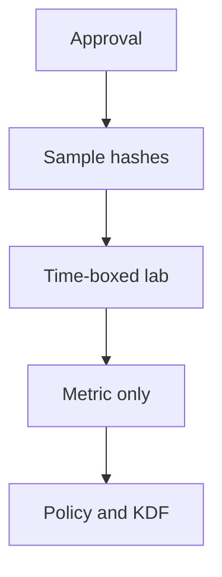

import { ConceptTemplate } from '@/features/kb/components/templates/ConceptTemplate'
import { Callout } from '@/features/kb/components/mdx/Callout'
import { ComparisonTable } from '@/features/kb/components/mdx/ComparisonTable'

export default function Layout({ children }) {
  return (
    <ConceptTemplate title="John the Ripper">
      {children}
    </ConceptTemplate>
  )
}

**John the Ripper** is an open-source password-recovery project (often "John"). Like Hashcat, its only clean use in a company is an **authorized audit of your own hashes** to show residual guessability. This page does not include formats, wordlists, or recovery commands.

## 1. Deep Dive and Mechanics

An audit program extracts a sample from a test system or an approved production snapshot, runs a time-boxed recovery in a locked lab, and reports a percentage. Then you **destroy the extract**. The engineering follow-through is Argon2id, salt, blocklists, and MFA.

**Unix history.** John grew up around crypt(3)-style hashes. Modern orgs should not still store those for interactive login.

**Legal.** Other people's hashes, "just to see," are out of bounds.

<Callout icon="error" title="A recovered password list is toxic data">
Store the metric. Wipe the secrets. Tell people to rotate if the audit used real accounts.
</Callout>

## 2. Mathematical / Theoretical Foundation

Guessing is search over a distribution that is not uniform (people pick seasons and pets). A KDF multiplies work per guess. Unique salts prevent one precomputation from covering the directory. MFA changes the payoff: a guessed password should not open the session.

<ComparisonTable
  headers={['Control', 'What it does', 'Gap it leaves']}
  rows={[
    ['Length + blocklist', 'Removes easy guesses', 'Phishing'],
    ['Slow KDF + salt', 'Raises offline cost', 'Reuse elsewhere'],
    ['MFA', 'Second factor', 'Fatigue / bad UX'],
    ['Passkeys', 'No shared secret', 'Recovery flow'],
  ]}
/>

## 3. Real-World Implementation

```text
# Authorized audit record
# Approver, date, system, sample size
# Lab host id, duration cap
# Result: percent recovered (no plaintext retained)
# Follow-up ticket: policy / KDF / MFA
```

Prefer forcing a reset over emailing anyone their recovered password.

## 4. Visualizations



## 5. Interview Prep

**Q: John vs Hashcat?**
**A:** Overlapping jobs. Hashcat is GPU-centric. John is common on Unix labs. Neither replaces MFA.

**Q: Should we audit monthly?**
**A:** Rarely. After a KDF change or a breach of the hash file, yes. Otherwise invest in IdP controls.

**Q: What if recovery is "too easy"?**
**A:** That is a successful audit. Fix the store and require MFA. Do not hide the result.

## 6. Production Use Cases

- **Legacy Linux** shadow-file migrations.
- **App-local** password tables you are deleting.
- **Compliance** evidence that offline guessability was measured.

<Callout icon="tip" title="Delete the app password table">
SSO plus passkeys makes this whole class of tools boring — that is the win.
</Callout>
