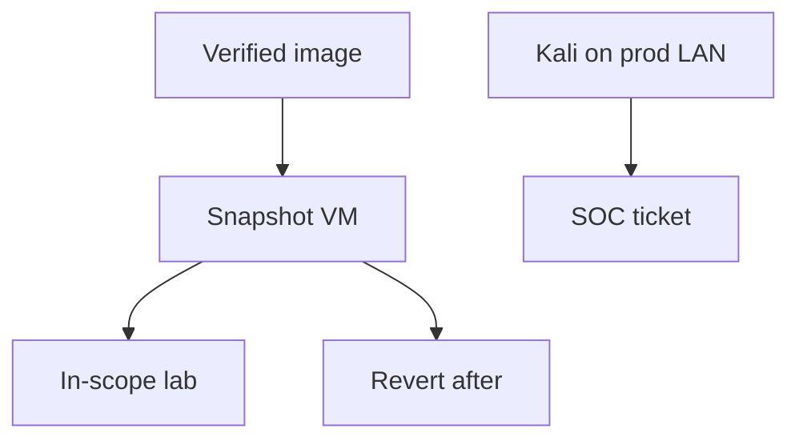

import { ConceptTemplate } from '@/features/kb/components/templates/ConceptTemplate'
import { Callout } from '@/features/kb/components/mdx/Callout'
import { ComparisonTable } from '@/features/kb/components/mdx/ComparisonTable'

export default function Layout({ children }) {
  return (
    <ConceptTemplate title="Kali Linux">
      {children}
    </ConceptTemplate>
  )
}

**Kali Linux** is a Debian-derived distro from Offensive Security that preinstalls many assessment tools. It is a **convenience image for authorized lab and contracted test work**. It is not a magic hacker OS, not a place to do your banking, and not permission to scan the internet. This page does not document those tools' attack modes.

## 1. Deep Dive and Mechanics

Use Kali (or a slim custom image) as a **VM with snapshots**, on an isolated network, under a test charter. Update it; old Kali is just another unpatched box. Do not store customer data on it. Do not join it to the corp domain.

**Defender view.** Seeing Kali in your DHCP or EDR is a signal: lab, contractor, or someone improvising. Have an allow-list of test VLANs and treat the rest as an incident.

**Alternatives.** Many teams build a golden "assessment" VM with only the tools they need, or use cloud lab vendors, to shrink supply-chain surprise.

<Callout icon="warning" title="Kali is a toolkit, not an authorization">
The distro does not make scanning legal. Scope and a letter do.
</Callout>

## 2. Mathematical / Theoretical Foundation

A penetration-testing distro is a software supply chain: hundreds of packages with their own CVEs. Risk is dual-use software plus operator error (wrong interface, wrong RFC1918). Isolation and snapshots are the compensating controls.

<ComparisonTable
  headers={['Use', 'OK?', 'Control']}
  rows={[
    ['Chartered lab VM', 'Yes', 'Isolated net, snapshots'],
    ['Daily laptop', 'No', 'Use a boring OS'],
    ['Unscoped internet scan', 'No', 'Crime / ToS'],
    ['Mystery USB ISO', 'No', 'Supply-chain risk'],
  ]}
/>

## 3. Real-World Implementation

```text
# Lab image policy
# - Official images only, checksum verified
# - Host-only or test VLAN networking
# - No corp SSO, no customer exports
# - Destroy or revert after the engagement
```

Contractors should bring a process, not a surprise laptop on the prod Wi-Fi.

## 4. Visualizations



## 5. Interview Prep

**Q: Do I need Kali to work in security?**
**A:** No. Most blue-team work is Windows logs, cloud consoles, and Python. Kali is optional convenience.

**Q: Why not install the tools on Ubuntu?**
**A:** You can. Kali is packaging. Many prefer a dedicated VM either way.

**Q: Is Kali "more secure"?**
**A:** It is a wide tool surface running as a powerful user. Treat it as dirty lab glassware.

## 6. Production Use Cases

- **Internal pentest** VMs on a test VLAN.
- **Training** classrooms with reset images.
- **SOC** detections for unexpected Kali DHCP fingerprints.

<Callout icon="tip" title="Checksum the ISO">
If you would not run a random Windows ISO, do not run a random Kali mirror either.
</Callout>
