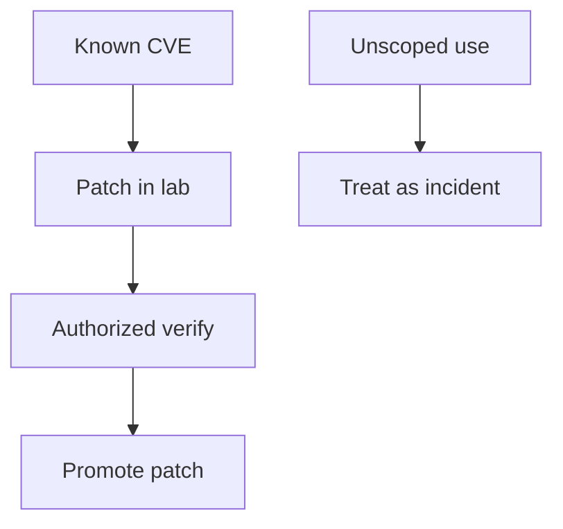

import { ConceptTemplate } from '@/features/kb/components/templates/ConceptTemplate'
import { Callout } from '@/features/kb/components/mdx/Callout'
import { ComparisonTable } from '@/features/kb/components/mdx/ComparisonTable'

export default function Layout({ children }) {
  return (
    <ConceptTemplate title="Metasploit Framework">
      {children}
    </ConceptTemplate>
  )
}

The **Metasploit Framework** is a large, open toolkit used in **authorized** tests and in training labs to replay **known** vulnerability classes against systems you own. Defenders also study it to write detections. This page does not describe modules, payloads, or how to "pop a shell."

## 1. Deep Dive and Mechanics

**Legitimate use.** Confirm that last year's CVE is not still open on a lab clone, or that an IPS signature fires. That work happens on images you built, with a ticket, on a network that cannot reach customers.

**Defender use.** Know that commodity kits exist so you prioritize patching and EDR. Hunt for post-compromise behaviors in general (unexpected services, odd outbound) rather than memorizing a product.

**Risk.** Pointing a framework at the wrong CIDR is a change-control incident. Untrusted module source is a supply-chain incident.

<Callout icon="error" title="No scope, no framework">
If you do not have written authorization and a target list, you do not have a test. You have a policy violation.
</Callout>

## 2. Mathematical / Theoretical Foundation

Metasploit is a catalog that maps public vulnerability identifiers to reusable test code. Coverage of "the internet" is irrelevant; coverage of **your** unpatched surface is the metric. Detection engineering treats framework defaults as a labeled dataset for purple-team days — still without publishing those defaults here.

<ComparisonTable
  headers={['Use', 'Outcome', 'Forbidden']}
  rows={[
    ['Lab CVE verify', 'Patch proof', 'Customer networks'],
    ['Purple-team detect', 'New SIEM rule', 'Unannounced prod'],
    ['Training VM', 'Skill', 'Shared creds on the VM'],
    ['Internet "research"', 'None', 'Always'],
  ]}
/>

## 3. Real-World Implementation

```text
# Lab verification record
# CVE, lab host name, snapshot id
# Expected: patched service refuses the old condition
# Evidence: ticket + screenshot of version / config
# No module output pasted into Slack
```

Prefer vendor patches and version evidence over "we ran a kit and it failed" as the only proof.

## 4. Visualizations



## 5. Interview Prep

**Q: Is Metasploit required to be a pentester?**
**A:** No. Many assessments are authz and logic. A framework is optional and dangerous if sloppy.

**Q: Why do SOCs mention Meterpreter?**
**A:** It is a well-known post-compromise agent family. Detect the behaviors; do not practice them on corp.

**Q: Framework vs exploit PoC from the internet?**
**A:** Both are dual-use. Your job in this KB is to patch and detect, not to collect kits.

## 6. Production Use Cases

- **Patch verification** on isolated clones.
- **IPS/EDR** regression after a signature change.
- **IR awareness** training that stays conceptual.

<Callout icon="tip" title="Version pins beat kits">
A configuration-management report that nothing runs the vulnerable version is the control you want.
</Callout>
