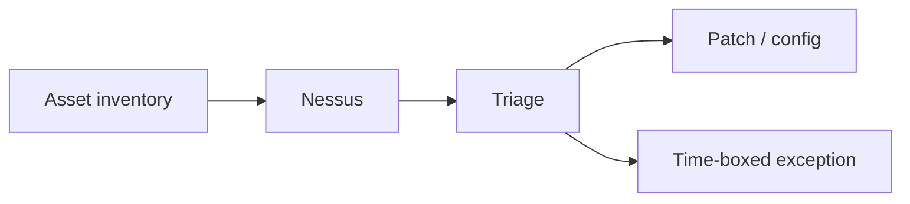

import { ConceptTemplate } from '@/features/kb/components/templates/ConceptTemplate'
import { Callout } from '@/features/kb/components/mdx/Callout'
import { ComparisonTable } from '@/features/kb/components/mdx/ComparisonTable'

export default function Layout({ children }) {
  return (
    <ConceptTemplate title="Nessus">
      {children}
    </ConceptTemplate>
  )
}

**Nessus** (Tenable) is a vulnerability scanner. It logs into or fingerprints systems you authorize and reports missing patches, weak TLS, and default accounts. It is an **inventory and hygiene** tool. It is not a pentest and not a green checkbox that you are safe.

## 1. Deep Dive and Mechanics

**Authenticated scans** see real package versions. Unauthenticated scans see banners and are noisier and blinder. Credentials for the scanner should be least privilege, rotated, and not Domain Admin.

**Operations.** Schedule by environment. Freeze windows exist. A scan that knocks over an old printer is a change event — start with discovery, then credentialed, then coverage SLAs.

**Triage.** CVSS is a hint. Exploitability in your network, asset value, and compensating controls decide the ticket. Close with a version bump, not "risk accepted" forever.

<Callout icon="warning" title="A scanner can be a DoS">
Aggressive plugins against fragile OT or a Friday prod batch will make you famous in the wrong way.
</Callout>

## 2. Mathematical / Theoretical Foundation

A scanner is a classifier over version tuples and config checks. False positives come from banner lies and missing auth. False negatives come from unscanned subnets and software the plugin set does not know. Coverage is |scanned assets| / |CMDB assets|. Residual risk is the unscanned and the unfixed.

<ComparisonTable
  headers={['Mode', 'Sees', 'Risk']}
  rows={[
    ['Discover', 'Who is alive', 'Low'],
    ['Unauthenticated', 'Banners', 'Blind to missing patches'],
    ['Authenticated', 'Packages / registry', 'Needs locked creds'],
    ['Agent', 'Laptop fleets', 'Agent health'],
  ]}
/>

## 3. Real-World Implementation

```text
# Scan program
# - Creds: local scan user, no interactive login, vaulted
# - Prod: agreed window, start-of-change ticket
# - SLA: critical internet-facing in 7 days, else exception
# - Export to the same tracker as AppSec
```

Deduplicate findings per image, not per clone of a scale set.

## 4. Visualizations



## 5. Interview Prep

**Q: Nessus vs pentest?**
**A:** Nessus lists known issues. A pentest shows impact and logic bugs scanners miss.

**Q: Why authenticated?**
**A:** Because "OpenSSH banner looks fine" is not the same as "kernel is current."

**Q: Nessus vs OpenVAS?**
**A:** Same job, different product and plugin economy. Process matters more than logo.

## 6. Production Use Cases

- **Weekly** infrastructure hygiene.
- **PCI ASV** adjacent internal scans (ASV itself is a specific service).
- **Laptop** fleets with agents.

<Callout icon="tip" title="Measure time-to-fix, not finding count">
A growing open-criticals chart is the only slide that matters.
</Callout>
