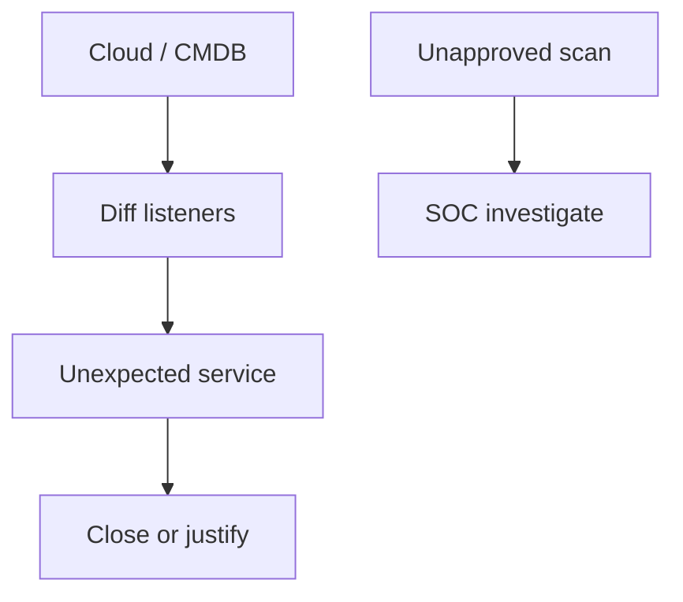

import { ConceptTemplate } from '@/features/kb/components/templates/ConceptTemplate'
import { Callout } from '@/features/kb/components/mdx/Callout'
import { ComparisonTable } from '@/features/kb/components/mdx/ComparisonTable'

export default function Layout({ children }) {
  return (
    <ConceptTemplate title="Nmap">
      {children}
    </ConceptTemplate>
  )
}

**Nmap** is a service-discovery tool. Defenders use it (or safer CMDB + agent inventory) to answer: what is listening that we did not expect? Unauthorized scanning of networks you do not own is illegal and out of scope here. This page does not provide scan recipes or evasion techniques.

## 1. Deep Dive and Mechanics

**Defensive inventory.** Compare a permitted internal discovery against the CMDB. A new SSH on a printer VLAN or a forgotten RDP on the internet is a ticket. Prefer orchestrated, rate-limited discovery from a known scanner identity so SOC can allow-list it.

**What Nmap is not.** It is not stealth, not an exploit tool, and not a substitute for flow logs and cloud security-group reviews (which often find the same exposure with less drama).

**Policy.** Publish who may run discovery, from which jump host, and how the SOC recognizes it. Surprise Nmap from a laptop looks like recon because it is.

<Callout icon="warning" title="Scanning is a privilege">
Even inside the company, a careless sweep can trip IDS, crash brittle gear, or violate a customer contract.
</Callout>

## 2. Mathematical / Theoretical Foundation

Discovery is probing a space of address times port. Completeness trades with courtesy (rate) and with the target's filter (what they show you). The defensive metric is unexpected-listener count, not "how thoroughly we probed." Cloud APIs often give a more authoritative listener list than packets.

<ComparisonTable
  headers={['Source of truth', 'Best for', 'Gap']}
  rows={[
    ['Cloud SG / NSG / NACL', 'Public exposure', 'Host process vs rule'],
    ['Agent inventory', 'Laptops / VMs', 'Unmanaged devices'],
    ['Authorized mapper', 'Unknown listeners', 'Noise, fragility'],
    ['Flow logs', 'Who actually spoke', 'No payload'],
  ]}
/>

## 3. Real-World Implementation

```text
# Inventory control
# - Weekly export of public listeners from the cloud API
# - Diff vs last week; ticket new 0.0.0.0/0 admin ports
# - If a mapper is used: named host, change ticket, SOC notice
```

Shut the port or put it behind SSO. Do not argue with the ticket about intent.

## 4. Visualizations



## 5. Interview Prep

**Q: Is Nmap a vulnerability scanner?**
**A:** No. It finds services. Vulnerability scanners (and humans) judge versions and config.

**Q: Why do SOCs alert on it?**
**A:** Because the same packets appear in real reconnaissance. Allow-list your official scanner.

**Q: Better first step for cloud?**
**A:** Dump security groups and public IPs. You will find most of the embarrassment without a packet tool.

## 6. Production Use Cases

- **Attack-surface** reviews of your own ranges.
- **M&A** inventory of an inherited plant network (with authorization).
- **SOC** tuning so official discovery is not a sev-1.

<Callout icon="tip" title="Prefer the control-plane list">
Cloud APIs do not lie about the rule. Hosts sometimes lie about the banner.
</Callout>
