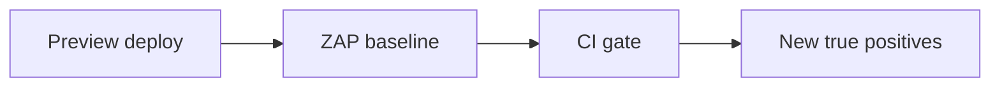

import { ConceptTemplate } from '@/features/kb/components/templates/ConceptTemplate'
import { Callout } from '@/features/kb/components/mdx/Callout'
import { ComparisonTable } from '@/features/kb/components/mdx/ComparisonTable'

export default function Layout({ children }) {
  return (
    <ConceptTemplate title="OWASP ZAP">
      {children}
    </ConceptTemplate>
  )
}

**OWASP ZED Attack Proxy (ZAP)** is a free intercepting proxy and scanner for web apps. AppSec teams put it in CI against **ephemeral preview environments** with synthetic users. It is not permission to scan third-party sites. This page does not cover exploit payloads or bypass recipes.

## 1. Deep Dive and Mechanics

**Manual.** Same idea as Burp: see the real requests, check that authz is server-side.

**Automation.** Baseline or full scans in CI on a disposable URL. Fail the build on high-confidence issues you have tuned (missing CSP is a conversation; a true open redirect on login is a stop). Keep the scan identity documented so prod WAF does not page.

**Noise.** DAST will yell. Maintain an allow-list with expiry, not a culture of ignoring the job.

<Callout icon="info" title="DAST cannot see your IDOR if it cannot log in">
Give the scanner a real role and a second role if you want access-control findings. Still only on systems you own.
</Callout>

## 2. Mathematical / Theoretical Foundation

DAST is dynamic testing: it explores a state graph of HTTP. Coverage is bounded by crawl quality and auth. False positives are inherent. Pair with SAST and code review. The CI gate is a policy on expected value, not a proof of absence of bugs.

<ComparisonTable
  headers={['Mode', 'When', 'Limit']}
  rows={[
    ['Proxy manual', 'Feature review', 'Human time'],
    ['CI baseline', 'Every PR preview', 'Shallow'],
    ['Nightly deeper', 'Main branch env', 'Flaky apps'],
    ['Prod scan', 'Rare, agreed', 'Customers and WAF'],
  ]}
/>

## 3. Real-World Implementation

```text
# CI DAST
# - Preview URL + synthetic user
# - Timeout and memory caps
# - Fail on tuned high rules only
# - Upload HTML report as a build artifact (restricted)
```

Do not scan production from a PR. You will DDoS yourself and poison analytics.

## 4. Visualizations



## 5. Interview Prep

**Q: ZAP vs Burp?**
**A:** Overlapping proxy jobs. ZAP is open and CI-friendly. Burp Pro is a common human-driven suite.

**Q: Will ZAP replace a pentest?**
**A:** No. It catches hygiene and some injection classes. Humans catch logic.

**Q: Safe to scan prod?**
**A:** Only with a window, rate limits, and a story for side effects (orders, emails).

## 6. Production Use Cases

- **PR previews** for internal apps.
- **Nightly** scans of staging.
- **Training** developers to read HTTP.

<Callout icon="tip" title="Tune or die">
An untuned DAST job becomes wallpaper in two sprints.
</Callout>
