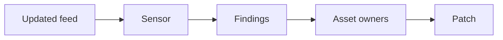

import { ConceptTemplate } from '@/features/kb/components/templates/ConceptTemplate'
import { Callout } from '@/features/kb/components/mdx/Callout'
import { ComparisonTable } from '@/features/kb/components/mdx/ComparisonTable'

export default function Layout({ children }) {
  return (
    <ConceptTemplate title="OpenVAS">
      {children}
    </ConceptTemplate>
  )
}

**OpenVAS** (the Greenbone Vulnerability Management stack) is an open-source cousin of commercial vuln scanners. It checks systems you authorize for known CVEs and weak configs. Use it as a **hygiene loop**, not as a pentest and not as a license to scan strangers.

## 1. Deep Dive and Mechanics

You deploy a manager plus sensors, feed them an allow-listed address space, and prefer **authenticated** checks. Feed quality and update cadence matter; a stale feed is a false sense of safety.

**Ops.** Same rules as Nessus: change windows, fragile OT, least-privilege scan creds, and tickets with SLAs. Deduplicate by image.

**Fit.** Budget-conscious orgs and labs. Enterprises may still buy a commercial feed and UI. The process is the product.

<Callout icon="warning" title="Open source does not mean unscoped">
Your legal boundary is the same as with a paid scanner.
</Callout>

## 2. Mathematical / Theoretical Foundation

Plugin hits are version and config predicates. Error bars are unscanned assets and lying banners. Track coverage and age of criticals. Do not average CVSS into a single "security score" for the board.

<ComparisonTable
  headers={['Scanner', 'Cost model', 'You still need']}
  rows={[
    ['OpenVAS / Greenbone', 'Software + people', 'Creds, SLAs, owners'],
    ['Nessus / Qualys / InsightVM', 'License + people', 'Same process'],
    ['Cloud posture', 'CSPM', 'IAM and data, not packages'],
    ['Agent inventory', 'EDR / MDM', 'Patch pipeline'],
  ]}
/>

## 3. Real-World Implementation

```text
# Program checklist
# - Feed updates on a calendar
# - Authenticated scans for servers you own
# - Ticket SLA by severity and exposure
# - Exception register with expiry
```

If nobody owns the OpenVAS VM, it will become an unpatched scanner — irony you cannot afford.

## 4. Visualizations



## 5. Interview Prep

**Q: OpenVAS vs Nessus?**
**A:** Same category. Licensing, feed, and UI differ. Ask about coverage and process.

**Q: Why do findings disagree across scanners?**
**A:** Different plugins and auth. Reconcile on package version, not on who yelled first.

**Q: Can I scan the internet "for research"?**
**A:** Not with this KB's blessing. Scan what you own or what a contract names.

## 6. Production Use Cases

- **Internal server** hygiene in cost-sensitive orgs.
- **Lab** networks for training.
- **Second opinion** next to a commercial scanner.

<Callout icon="tip" title="Patch the scanner too">
A vuln scanner with a stale OS is a free foothold on the management network.
</Callout>
