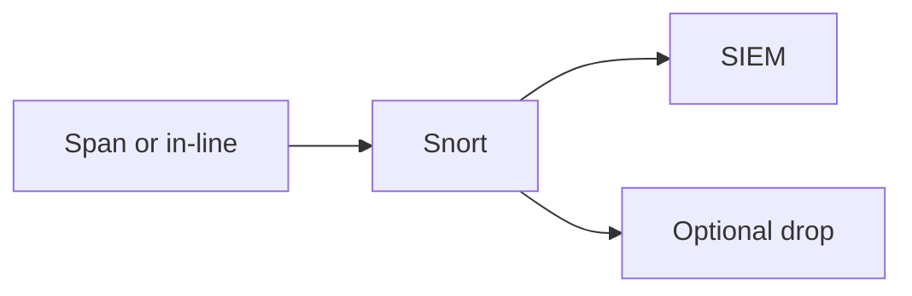

import { ConceptTemplate } from '@/features/kb/components/templates/ConceptTemplate'
import { Callout } from '@/features/kb/components/mdx/Callout'
import { ComparisonTable } from '@/features/kb/components/mdx/ComparisonTable'

export default function Layout({ children }) {
  return (
    <ConceptTemplate title="Snort">
      {children}
    </ConceptTemplate>
  )
}

**Snort** is a long-lived network intrusion detection (and, in-line, prevention) engine. You feed it a span or a bump-in-the-wire and a ruleset. It is a **detection control**, not an attack tool. Encrypted traffic limits what payload rules can see unless you inspect at a trusted break.

## 1. Deep Dive and Mechanics

**IDS mode.** Copy of traffic, alerts to the SIEM. Safe. **IPS mode.** In-line drop. Fast and able to hurt availability if a rule is wrong.

**Rules.** Community, subscription, and your locals. Each rule needs an owner and a disable path. Tune or you will drown.

**Placement.** Internet edge, egress, and a few east-west chokepoints. You cannot span the whole cloud by wishing.

<Callout icon="info" title="TLS is most of the packet">
Without a designed TLS inspection point, many payload rules become metadata and JA3-style guesses.
</Callout>

## 2. Mathematical / Theoretical Foundation

Snort rules are pattern matchers over packets and streams (content, PCRE, flow). Detection is approximate: evasion and encryption exist. IPS adds a fail-closed/fail-open decision. False-positive rate times traffic volume is the SOC cost.

<ComparisonTable
  headers={['Mode', 'On path?', 'Failure']}
  rows={[
    ['IDS', 'No', 'You miss silently'],
    ['IPS', 'Yes', 'You drop good traffic'],
    ['NSM (Suricata/Zeek)', 'Usually no', 'Storage cost'],
    ['Host EDR', 'Host', 'Unmanaged devices'],
  ]}
/>

## 3. Real-World Implementation

```text
# Rule hygiene
# - Pull official sets on a schedule
# - Every local rule has an owner and a ticket
# - Disable with a comment, never "delete and forget"
# - Alert to SIEM with sensor id and src/dst
```

Test new drop rules in alert-only for a week.

## 4. Visualizations



## 5. Interview Prep

**Q: Snort vs Suricata?**
**A:** Same niche. Suricata is multi-thread and often faster on modern NICs. Snort 3 modernized the old engine. Pick operations, not religion.

**Q: IDS vs IPS?**
**A:** Detect vs block. Blocking needs change control and a rollback.

**Q: Why still use NIDS in a Zero Trust world?**
**A:** Egress malware, guest networks, and places you do not have EDR.

## 6. Production Use Cases

- **Campus egress** IDS.
- **OT** spans where you cannot put agents.
- **Lab** teaching of detection engineering.

<Callout icon="tip" title="Name the sensor in the alert">
"Snort fired" without which site and which interface is not an alert.
</Callout>
