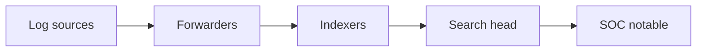

import { ConceptTemplate } from '@/features/kb/components/templates/ConceptTemplate'
import { Callout } from '@/features/kb/components/mdx/Callout'
import { ComparisonTable } from '@/features/kb/components/mdx/ComparisonTable'

export default function Layout({ children }) {
  return (
    <ConceptTemplate title="Splunk">
      {children}
    </ConceptTemplate>
  )
}

**Splunk** is a widely deployed log and SIEM platform. Security teams use it to **search and alert** on auth, EDR, proxy, and cloud audit data. It is not magic visibility. If you did not collect the log, Splunk cannot invent it. Cost is usually ingest volume, so the architecture problem is **what to keep hot**.

## 1. Deep Dive and Mechanics

**Ingest.** Forwarders or APIs land events. Parse enough fields to alert (user, src, dest, action). Normalize with a CIM-like model so a failed login looks the same from Okta and from VPN.

**Detect.** Saved searches and risk-based alerting. Each notable needs a runbook and an owner. Correlation is "these two facts together," not a 40-join novel.

**Retain.** Hot/warm/cold and an archive. IR will ask for 90 days the first time you kept 7.

<Callout icon="warning" title="License pressure deletes your best evidence">
If finance caps ingest, cut debug logs before you cut IdP and EDR.
</Callout>

## 2. Mathematical / Theoretical Foundation

A SIEM is an index plus a query language plus a scheduler. Detection quality is precision/recall under an ingest budget. Cardinality of fields (user, dest) drives storage. Risk scores are weighted sums — be honest that the weights are policy, not physics.

<ComparisonTable
  headers={['Data', 'Keep hot?', 'Why']}
  rows={[
    ['IdP / VPN / EDR', 'Yes', 'IR always asks'],
    ['Cloud audit', 'Yes', 'Key theft'],
    ['App debug', 'Sample', 'Cost'],
    ['Packet PCAP', 'On demand', 'Storage'],
  ]}
/>

## 3. Real-World Implementation

```text
# Use-case: repeated SSO failures then a success from a new country
# Data: IdP + VPN
# Action: revoke sessions, page identity on-call
# Tune: known travel, break-glass accounts
```

Require a named owner on every enabled notable. Ownerless alerts are noise.

## 4. Visualizations



## 5. Interview Prep

**Q: Splunk vs "the cloud SIEM"?**
**A:** Same job. Ask about ingest cost, detection-as-code, and who writes the searches.

**Q: What is a notable?**
**A:** An alert instance the SOC is meant to work. If they cannot work it, it should not exist.

**Q: How long to retain?**
**A:** Threat and legal (often 90–365 days for security logs). Decide on purpose, not default.

## 6. Production Use Cases

- **Enterprise SOC** correlation.
- **Compliance** evidence searches.
- **Threat hunts** with a saved hypothesis.

<Callout icon="tip" title="Detection as code">
Reviews for searches should look like reviews for application code.
</Callout>
