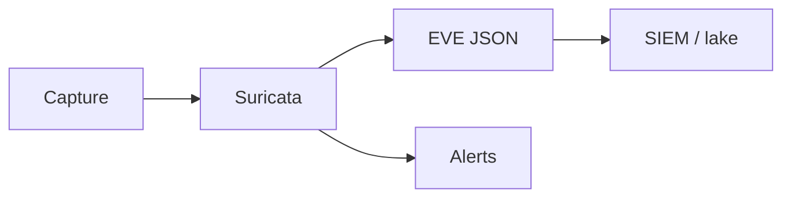

import { ConceptTemplate } from '@/features/kb/components/templates/ConceptTemplate'
import { Callout } from '@/features/kb/components/mdx/Callout'
import { ComparisonTable } from '@/features/kb/components/mdx/ComparisonTable'

export default function Layout({ children }) {
  return (
    <ConceptTemplate title="Suricata">
      {children}
    </ConceptTemplate>
  )
}

**Suricata** is an open-source IDS/IPS and NSM engine (OISF). It inspects traffic you feed it and can emit alerts plus protocol logs (HTTP, DNS, TLS metadata). Defenders use it on **their** spans and gateways. This page is about detection operations, not evasion or offensive use.

## 1. Deep Dive and Mechanics

**Performance.** Multi-thread and a modern capture story (AF_PACKET, DPDK in some shops). That is why many teams picked it over legacy single-thread Snort.

**Outputs.** EVE JSON to a SIEM or to a lake. TLS SNI, DNS queries, and file hashes from reconstructed streams are often more useful than a single payload rule.

**Rules.** Emerging Threats and others. Same hygiene as Snort: owners, staging, and no silent IPS in week one.

<Callout icon="info" title="Metadata outlives payload rules">
Even when HTTPS hides the body, DNS and SNI still tell a story — and they are still privacy-sensitive logs.
</Callout>

## 2. Mathematical / Theoretical Foundation

Suricata is a stream reassembly and signature engine plus protocol parsers. Throughput is packets per second versus CPU and a drop counter you must watch. Detection remains a pattern-match with evasion and encryption limits. NSM logs are a high-volume telemetry source; sample or filter or go bankrupt on storage.

<ComparisonTable
  headers={['Output', 'Use', 'Careful']}
  rows={[
    ['Alert', 'SOC queue', 'Noise'],
    ['EVE DNS/TLS', 'Hunt', 'PII in names'],
    ['Files', 'Malware hash', 'Disk'],
    ['Drop (IPS)', 'Block', 'Availability'],
  ]}
/>

## 3. Real-World Implementation

```text
# Sensor standard
# - Named site and link
# - EVE to SIEM with sensor tags
# - Drop counters on the dashboard
# - New drop rules alert-only first
```

Keep a packet-loss graph next to the alert graph. A silent sensor is worse than none.

## 4. Visualizations



## 5. Interview Prep

**Q: Suricata vs Snort vs Zeek?**
**A:** Suricata and Snort are signature IDS/IPS. Zeek is a protocol logger and scripting NSM. Many stacks run Suricata plus Zeek.

**Q: Why EVE JSON?**
**A:** One structured stream for alerts and protocol events. Easier than a pile of custom log formats.

**Q: Cloud equivalent?**
**A:** VPC traffic mirroring is expensive. Often you use DNS, flow, and host EDR instead of a full NIDS.

## 6. Production Use Cases

- **Egress** monitoring at the office edge.
- **DC** chokepoints you still own.
- **Purple-team** validation that a scenario produced an alert.

<Callout icon="tip" title="Watch the drop counter">
If the NIC is overflowing, you are not detecting. You are sampling at random.
</Callout>
