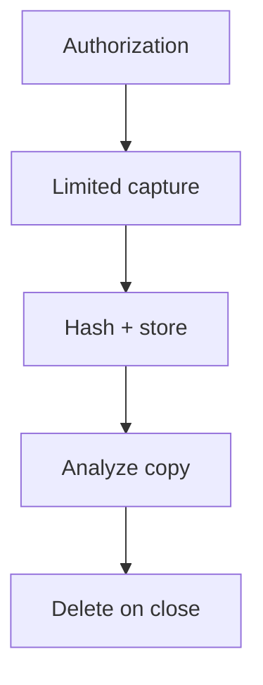

import { ConceptTemplate } from '@/features/kb/components/templates/ConceptTemplate'
import { Callout } from '@/features/kb/components/mdx/Callout'
import { ComparisonTable } from '@/features/kb/components/mdx/ComparisonTable'

export default function Layout({ children }) {
  return (
    <ConceptTemplate title="Wireshark">
      {children}
    </ConceptTemplate>
  )
}

**Wireshark** (and CLI tshark) decodes packet captures so you can see why a handshake failed or whether a host spoke to an unexpected name. It is a **microscope for authorized captures**. Capturing on a shared LAN without a charter can be illegal wiretapping. This page does not cover interception tricks or credential harvesting.

## 1. Deep Dive and Mechanics

**Capture.** On a span, a tap, or the local host you own. Write to pcap with a size limit. Stop. Analyze the file, not a forever live click-fest on a busy link.

**Analyze.** Display filters (tls, dns, ip.addr) to shrink the view. Follow a TCP stream for a cleartext protocol you are allowed to see. For TLS you will mostly see metadata unless you have a lab key you are allowed to load.

**Privacy.** Pcaps contain everything: tokens, health data, home addresses in DNS. Treat them as restricted evidence. Do not email them.

<Callout icon="warning" title="A pcap is a full recording">
If you would not put the payload in a ticket, do not put the pcap on a shared drive.
</Callout>

## 2. Mathematical / Theoretical Foundation

Packet analysis is reconstructing streams from a capture with possible loss. Wireshark's dissectors implement protocol state machines. Completeness requires you were on path. Encrypted payloads reduce the tool to timing, sizes, and cleartext headers (SNI depending on TLS version and settings).

<ComparisonTable
  headers={['Job', 'Wireshark', 'Better tool']}
  rows={[
    ['One broken handshake', 'Excellent', 'Sometimes just ssl_error logs'],
    ['Fleet malware', 'Too small', 'EDR + DNS'],
    ['Legal evidence', 'If hashed pcap', 'Full IR process'],
    ['Perf in the cloud', 'Hard to span', 'VPC flow, service mesh'],
  ]}
/>

## 3. Real-World Implementation

```text
# Capture card
# Reason, approver, host or tap
# Max size / time, SHA-256 of the file
# Retention and who may read
# Delete when the ticket closes
```

On endpoints, prefer a short capture during a repro over a weekend-long sniff.

## 4. Visualizations



## 5. Interview Prep

**Q: Wireshark vs tcpdump?**
**A:** tcpdump captures. Wireshark is the richer decoder GUI. Same legal rules.

**Q: Can you read HTTPS?**
**A:** Not the body, unless you have a permitted lab key or a TLS break you already operate.

**Q: Why is my capture empty in the cloud?**
**A:** You are not on path. Use flow logs or a service mesh tap the platform provides.

## 6. Production Use Cases

- **IR** on a single host's odd connections.
- **TLS** troubleshooting in a staging lab.
- **OT** protocol debugging on a tap you own.

<Callout icon="tip" title="Filter at capture time when you can">
A 40 GB pcap of the wrong VLAN helps no one and endangers everyone in it.
</Callout>
