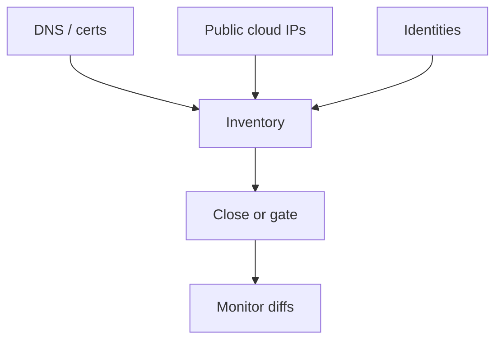

import { ConceptTemplate } from '@/features/kb/components/templates/ConceptTemplate'
import { Callout } from '@/features/kb/components/mdx/Callout'
import { ComparisonTable } from '@/features/kb/components/mdx/ComparisonTable'

export default function Layout({ children }) {
  return (
    <ConceptTemplate title="Attack Surface">
      {children}
    </ConceptTemplate>
  )
}

The **attack surface** is everything an outsider or insider can reach: public IPs, SaaS tenants, employee laptops, vendor VPNs, forgotten subdomains, and the APIs behind your mobile app. You cannot patch what you cannot see. The discipline is **inventory, shrink, and watch**.

## 1. Deep Dive and Mechanics

**External.** DNS names, certificates, cloud public IPs, object stores, and partner callbacks. Shadow IT and expired marketing sites are regular members.

**Identity.** Every account that can mint a session — humans, CI bots, OAuth apps — is surface. A public login box is smaller than a leaked refresh token with no rotation.

**Internal.** Flat networks and standing admin make the internal surface almost equal to "any phished laptop." Segmentation and least privilege shrink that.

<Callout icon="info" title="Surface is not just ports">
A support inbox that will reset a password from a convincing story is surface. So is an S3 bucket with a guessable name.
</Callout>

## 2. Mathematical / Theoretical Foundation

Model surface as a set of entry points with reachability to assets. Risk is not |surface| alone; it is the measure of high-value, low-control points. External attack-surface management (EASM) is a discovery process with false positives. The useful derivative is d(unexpected public services)/dt, not a vanity count of IPs.

<ComparisonTable
  headers={['Slice', 'Examples', 'Shrink by']}
  rows={[
    ['Network', 'Public IPs, VPNs', 'SG review, close admin'],
    ['App', 'Routes, uploads', 'Authz, WAF, less debug'],
    ['Identity', 'SSO, tokens, keys', 'MFA, rotation, JIT'],
    ['Supply', 'Vendors, CI', 'BAA, least scope, OIDC'],
  ]}
/>

## 3. Real-World Implementation

```text
# Weekly surface review
# - Dump public IPs, load balancers, and DNS
# - Diff vs last week
# - Ticket new listeners and unknown certificates
# - Confirm object stores block public access
```

Give someone the job. An unread EASM email is not a control.

## 4. Visualizations



## 5. Interview Prep

**Q: Attack surface vs attack vector?**
**A:** Surface is what exists to touch. A vector is a path through it (phish, stolen key, vuln).

**Q: How do you shrink it?**
**A:** Remove products, close ports, require SSO, delete unused apps, and segment.

**Q: Why do acquisitions hurt?**
**A:** You inherit unknown DNS and VPN concentrators on Friday afternoon.

## 6. Production Use Cases

- **Internet-facing** product orgs.
- **M&A** day-1 inventory.
- **Bug bounty** scope that matches reality.

<Callout icon="tip" title="Your marketing subdomain is in scope whether you like it or not">
Attackers do not honor the org chart.
</Callout>
