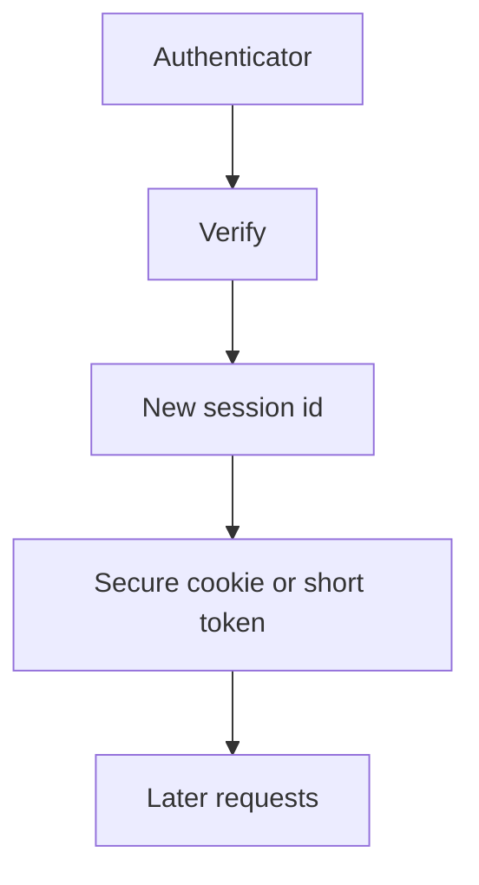

import { ConceptTemplate } from '@/features/kb/components/templates/ConceptTemplate'
import { Callout } from '@/features/kb/components/mdx/Callout'
import { ComparisonTable } from '@/features/kb/components/mdx/ComparisonTable'

export default function Layout({ children }) {
  return (
    <ConceptTemplate title="Authentication">
      {children}
    </ConceptTemplate>
  )
}

**Authentication (authn)** answers "who is this?" A password, a passkey, a one-time code, or a workload certificate are authenticators. A session cookie or token is the later proof. Authentication is not authorization. A perfect login to the wrong permission set is still a breach.

## 1. Deep Dive and Mechanics

A good login verifies a secret or a hardware-bound key, then **issues a new session identifier** that is random, stored server-side or as a short-lived signed token with rotation, and bound to a cookie with Secure and HttpOnly flags when the client is a browser.

**Factors.** Something you know, have, or are. Phishing-resistant factors (WebAuthn) beat OTPs that can be relayed. Workloads should use cloud roles or SPIFFE-style identities, not a password in an env file.

**Lifecycle.** Disable on leaver. Step-up for sensitive actions. Invalidate sessions on password change.

<Callout icon="warning" title="A login API that trusts a client-supplied user id is not authentication">
That is a costume. The server must verify an authenticator.
</Callout>

## 2. Mathematical / Theoretical Foundation

Authentication protocols need freshness (nonces, timestamps) so replays fail. Session IDs need enough entropy that guessing is worse than other breaks (128+ bits). Password KDFs exist because humans pick low-entropy secrets. WebAuthn is a challenge-response that keeps the private key in an authenticator.

<ComparisonTable
  headers={['Authenticator', 'Phish resistant?', 'Typical use']}
  rows={[
    ['Password', 'No', 'Legacy, plus extras'],
    ['OTP / SMS', 'No', 'Better than password only'],
    ['WebAuthn / passkey', 'Yes', 'Workforce and consumer'],
    ['Workload cert / role', 'N/A (machine)', 'Services'],
  ]}
/>

## 3. Real-World Implementation

```python
import secrets

def new_session_id() -> str:
    return secrets.token_urlsafe(32)
```

Rotate the id at login and after step-up. Store reset tokens as hashes with a short TTL.

## 4. Visualizations



## 5. Interview Prep

**Q: Authn vs authz?**
**A:** Authn identifies. Authz permits. Mixing them is how "logged in" becomes "admin."

**Q: Why not JWT in localStorage?**
**A:** XSS can read it. Prefer HttpOnly cookies or a BFF.

**Q: Is MFA always enough?**
**A:** Promptable MFA can be phished. Prefer phishing-resistant MFA for admins.

## 6. Production Use Cases

- **Consumer** login with stuffing defenses.
- **Workforce SSO** to the IdP.
- **Service-to-service** identities in the mesh.

<Callout icon="tip" title="Log success and failure, never the secret">
You need the timeline. You do not need the password in the log line.
</Callout>
