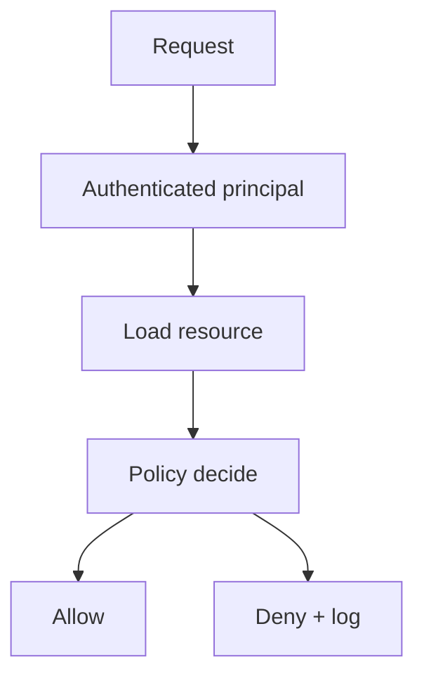

import { ConceptTemplate } from '@/features/kb/components/templates/ConceptTemplate'
import { Callout } from '@/features/kb/components/mdx/Callout'
import { ComparisonTable } from '@/features/kb/components/mdx/ComparisonTable'

export default function Layout({ children }) {
  return (
    <ConceptTemplate title="Authorisation">
      {children}
    </ConceptTemplate>
  )
}

**Authorisation (authz)** answers "may they do this?" after authentication. It is the check on every request: this user, this verb, this object, this tenant. Hidden buttons are not authz. The server must deny by default.

## 1. Deep Dive and Mechanics

Put the decision in a shared layer (policy engine, middleware, or capability tokens you mint). Look up the object, then test ownership, role, or relationship. Do not trust a client-supplied owner id.

**Models.** RBAC for job bundles. ABAC for attributes (clearance, geo). ReBAC for document sharing. Hybrid is normal.

**Failures.** IDOR (change the id), missing function-level checks, and cross-tenant leaks in SaaS. Tests should call the API as user A against user B's objects.

<Callout icon="error" title="UI hiding is not a control">
If the API performs the action, the API must refuse it.
</Callout>

## 2. Mathematical / Theoretical Foundation

Authz is a function allow(principal, action, resource, context) to boolean. Confused-deputy bugs happen when a powerful service uses its own identity to act on a caller-supplied target. Formal policy languages (Rego, Cedar, Zanzibar-style graphs) exist so the function is reviewable and testable.

<ComparisonTable
  headers={['Model', 'Grant', 'Typical fail']}
  rows={[
    ['RBAC', 'Role contains verbs', 'Role explosion / stale admin'],
    ['ABAC', 'Policy on attributes', 'Attribute lying / drift'],
    ['ReBAC', 'Walk relationships', 'Missing edge checks'],
    ['ACL', 'Per-object list', 'Does not scale'],
  ]}
/>

## 3. Real-World Implementation

```python
def can_read(user, doc) -> bool:
    if user.role == "admin" and user.tenant == doc.tenant:
        return True
    return doc.owner_id == user.id and user.tenant == doc.tenant
```

Always compare tenant. Always load the doc server-side. Never take owner_id from the body as truth.

## 4. Visualizations



## 5. Interview Prep

**Q: Why is broken access control OWASP number one?**
**A:** Every feature adds an object id. People forget the check. Impact is direct data.

**Q: RBAC vs ABAC?**
**A:** RBAC is simple until it is not. ABAC fits messy tenancy and risk, at the cost of policy complexity.

**Q: Can the gateway do all authz?**
**A:** Coarse yes (is this user in the app). Object-level usually needs the service that owns the object.

## 6. Production Use Cases

- **Multi-tenant SaaS** object APIs.
- **Admin consoles** with step-up plus role checks.
- **Internal tools** that must not be "VPN equals admin."

<Callout icon="tip" title="Write the negative test first">
User A must get 404 or 403 on user B's invoice. If you did not write that test, you do not have authz.
</Callout>
