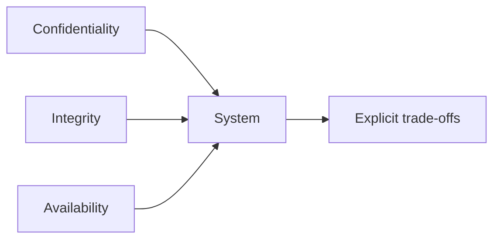

import { ConceptTemplate } from '@/features/kb/components/templates/ConceptTemplate'
import { Callout } from '@/features/kb/components/mdx/Callout'
import { ComparisonTable } from '@/features/kb/components/mdx/ComparisonTable'

export default function Layout({ children }) {
  return (
    <ConceptTemplate title="The CIA Triad">
      {children}
    </ConceptTemplate>
  )
}

The **CIA triad** is the shortest useful model of what "secure" means. **Confidentiality** is who may read. **Integrity** is who may change and whether you can detect change. **Availability** is whether authorized people can use the system. Every control maps to at least one. Trade-offs are normal: a lockout policy helps confidentiality and can hurt availability.

## 1. Deep Dive and Mechanics

**Confidentiality.** Encryption at rest and in transit, access control, and least privilege. A public bucket fails this pillar even if nobody "hacked" a server.

**Integrity.** Hashes, signatures, backups with immutability, input validation, and change control. Ransomware is an integrity and availability event.

**Availability.** Redundancy, DDoS absorption, patching that does not brick the fleet, and tested restores. A perfectly secret dead system is still a failure.

<Callout icon="info" title="Sometimes people add authenticity or non-repudiation">
Those are useful. Start with CIA; you can always refine.
</Callout>

## 2. Mathematical / Theoretical Foundation

CIA is a requirements taxonomy, not a theorem. Confidentiality is closeness to Shannon-style secrecy in practice (keys, access). Integrity is unforgeability and tamper evidence (MAC, signature, hash chain). Availability is a reliability SLO under adversarial load as well as honest failure. You cannot maximize all three without cost.

<ComparisonTable
  headers={['Pillar', 'Fails when', 'Typical control']}
  rows={[
    ['Confidentiality', 'Wrong party reads', 'Encryption, IAM'],
    ['Integrity', 'Wrong party changes', 'Signatures, FIM'],
    ['Availability', 'Right party cannot use', 'HA, backups, DDoS'],
  ]}
/>

## 3. Real-World Implementation

```text
# Design review prompt
# - Who may read this field?
# - How do we detect unauthorized change?
# - What happens if this region or this key store dies?
```

Write the answers in the design doc. "We use AWS" is not an answer.

## 4. Visualizations



## 5. Interview Prep

**Q: Give one control per pillar.**
**A:** TLS (C), signed commits or hashes (I), multi-AZ plus backups (A).

**Q: Where does MFA sit?**
**A:** Mostly confidentiality and integrity of sessions. Done badly it harms availability.

**Q: Is CIA enough for privacy law?**
**A:** No. Privacy adds purpose, minimisation, and rights. CIA is still the security core.

## 6. Production Use Cases

- **Architecture reviews** of a new service.
- **Incident severity** (which pillars were hit).
- **Control mapping** in GRC.

<Callout icon="tip" title="Name the pillar in the ticket">
"Fix availability" and "stop the leak" are different owners and different clocks.
</Callout>
