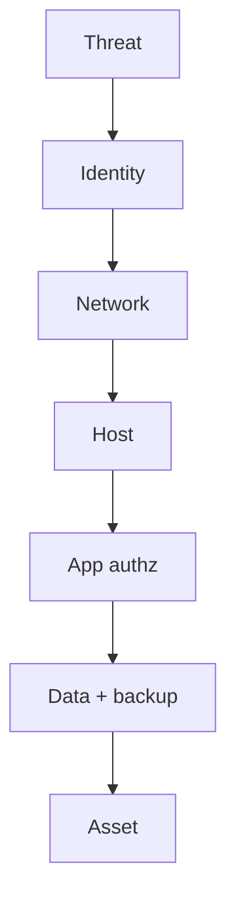

import { ConceptTemplate } from '@/features/kb/components/templates/ConceptTemplate'
import { Callout } from '@/features/kb/components/mdx/Callout'
import { ComparisonTable } from '@/features/kb/components/mdx/ComparisonTable'

export default function Layout({ children }) {
  return (
    <ConceptTemplate title="Defence in Depth">
      {children}
    </ConceptTemplate>
  )
}

**Defence in depth** means more than one independent control between a threat and an asset. A WAF without authz is a single pane of glass. Authz without logging is a silent failure. Depth is **heterogeneous layers**: identity, network, host, application, data, and detection.

## 1. Deep Dive and Mechanics

Pick layers that fail differently. MFA fails phishing (sometimes). Network policy fails a stolen laptop less. EDR fails a novel file less. Immutable backups fail ransomware's encryption. None is enough.

**Anti-pattern.** Six products that all check the same WAF signature, or "we have a firewall" as the entire story. Depth is not a shopping count.

**Measure.** For a crown-jewel path, list the controls a single stolen laptop would still have to pass. If the answer is "none," you have a moat-and-hope design.

<Callout icon="warning" title="Duplicate tools are not depth">
Two AV engines on one host can still miss the same class. Different layers, different failure modes.
</Callout>

## 2. Mathematical / Theoretical Foundation

If controls are independent with miss probabilities p_i, the joint miss is the product — independence is the lie you must check. Common-mode failure (one IdP, one CI, one cloud account) collapses the product. Reliability engineering's "redundant diverse systems" is the same idea.

<ComparisonTable
  headers={['Layer', 'Example', 'Fails when']}
  rows={[
    ['Identity', 'SSO + MFA', 'Session theft'],
    ['Network', 'Segmentation', 'Allowed path'],
    ['Host', 'EDR + hardening', 'No sensor'],
    ['Data', 'Encryption + backup', 'Key + live encrypt'],
  ]}
/>

## 3. Real-World Implementation

```text
# Crown-jewel path
# Asset: payroll DB
# Layers: SSO, JIT admin, private net, IAM role, encryption, audit, immutable backup
# Exercise: which still hold if a laptop is phished?
```

If the honest answer is "the phish is enough," add a layer or shrink standing access.

## 4. Visualizations



## 5. Interview Prep

**Q: Depth vs hard perimeter?**
**A:** Perimeter is one layer. Depth assumes that layer fails.

**Q: Is Zero Trust against depth?**
**A:** No. Zero Trust is identity-centric depth. You still want detection and backups.

**Q: How many layers?**
**A:** Enough that one realistic failure does not reach the jewel. Not "all the vendors."

## 6. Production Use Cases

- **Ransomware** programs (prevent + detect + immutable backup).
- **Payments** (PCI plus app authz plus monitoring).
- **Admin planes** (PAM + network + logging).

<Callout icon="tip" title="Test a layer by removing it on paper">
If the story collapses, that layer was your only control.
</Callout>
