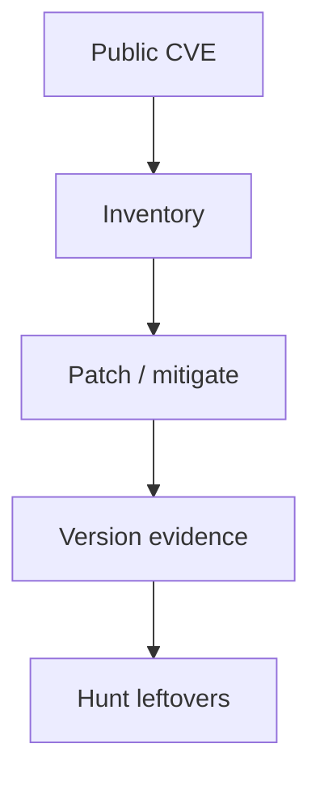

import { ConceptTemplate } from '@/features/kb/components/templates/ConceptTemplate'
import { Callout } from '@/features/kb/components/mdx/Callout'
import { ComparisonTable } from '@/features/kb/components/mdx/ComparisonTable'

export default function Layout({ children }) {
  return (
    <ConceptTemplate title="Exploits">
      {children}
    </ConceptTemplate>
  )
}

An **exploit** is a use of a vulnerability that makes a system behave outside its contract (crash, run unexpected code, leak data). A **payload** in casual talk is "what happens after." This knowledge base treats both as **objects of defense**: patch the hole, shrink the blast radius, and detect the aftermath. It does not teach how to write or run exploits.

## 1. Deep Dive and Mechanics

**Prevention.** Patch, configuration hardening, and memory-safety (languages, compiler flags, sandboxing). Remove the class when you can (memory-safe rewrite, managed runtime).

**Mitigation.** ASLR, NX/DEP, Control-flow integrity, least privilege, and sandboxing make a successful exploit less useful even when a bug remains. They are not a substitute for fixing known CVEs.

**Detection and response.** EDR and NIDS look for post-compromise behaviors. Your job after a public CVE is inventory, patch SLA, and hunting for the vulnerable version — not collecting kits.

<Callout icon="error" title="This page stops at defense">
No exploit steps, no PoCs, no payload construction. If you need to verify a fix, use a vendor patch and a version check on systems you own.
</Callout>

## 2. Mathematical / Theoretical Foundation

A vulnerability is a state the designer did not intend (memory unsafety, missing authz). An exploit is a witness that the state is reachable from attacker-controlled input. Mitigations raise the cost of turning a bug into reliable control. Formal methods and memory-safe languages shrink the bug class. Residual risk is always nonzero.

<ComparisonTable
  headers={['Defense', 'Acts on', 'Limit']}
  rows={[
    ['Patch', 'Known CVE', 'Zero-days, lag'],
    ['Memory safety', 'Whole class', 'Logic bugs remain'],
    ['Sandbox / least priv', 'Impact', 'Escape bugs'],
    ['EDR / backups', 'Aftermath', 'Need to be on'],
  ]}
/>

## 3. Real-World Implementation

```text
# Public-CVE playbook
# 1. Inventory who runs the product / library
# 2. Apply vendor patch or mitigate per vendor note
# 3. Verify version, not a kit
# 4. Hunt for unexpected processes or outbound on exposed hosts
```

Subscribe to vendor and CISA notes. Time-to-inventory beats time-to-Twitter.

## 4. Visualizations



## 5. Interview Prep

**Q: Vulnerability vs exploit?**
**A:** A vulnerability is the weakness. An exploit is a working use of it. You can have a vuln with no public exploit and still need to patch.

**Q: Why mitigations if we patch?**
**A:** Because you will be late sometimes, and some bugs are unknown.

**Q: Should engineers study exploit write-ups?**
**A:** High-level write-ups help you design safer systems. Reproducing weaponized code is out of scope here.

## 6. Production Use Cases

- **Vulnerability management** SLAs.
- **Hardening baselines** (NX, ASLR, sandbox).
- **IR** after a widely exploited CVE week.

<Callout icon="tip" title="Measure exposure, then patch">
"Is it on the internet and unpatched?" is the first question, not "can we reproduce the issue."
</Callout>
