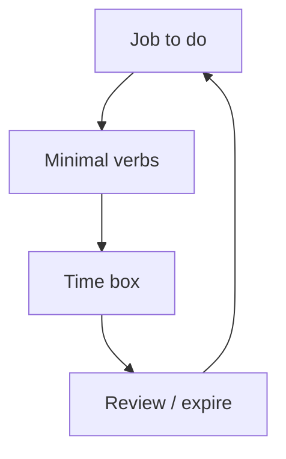

import { ConceptTemplate } from '@/features/kb/components/templates/ConceptTemplate'
import { Callout } from '@/features/kb/components/mdx/Callout'
import { ComparisonTable } from '@/features/kb/components/mdx/ComparisonTable'

export default function Layout({ children }) {
  return (
    <ConceptTemplate title="Least Privilege">
      {children}
    </ConceptTemplate>
  )
}

**Least privilege** is a design rule: default deny, then add the smallest permission that still works. It applies to humans, roles, tokens, CI, and database users. Standing Domain Admin and `s3:*` are the opposite. Most incidents become disasters because privilege was already waiting.

## 1. Deep Dive and Mechanics

**Humans.** Role bundles, just-in-time elevation, and recertification. Break-glass is short, logged, and paged.

**Workloads.** One role per task. CI deploys with a deploy role, not the developer's cloud keys. Database users that can only SELECT the tables they need.

**Time and blast radius.** Temporary credentials beat long-lived keys. Separate prod from sandbox accounts so a leaked CI token cannot wipe billing.

<Callout icon="warning" title="Privilege grows like ivy">
Nobody opens a ticket to add access and later opens one to remove it. Reviews and JIT are the weeding.
</Callout>

## 2. Mathematical / Theoretical Foundation

Privilege is the reachable set in an IAM graph. Least privilege is a minimization under the constraint "the job still completes." Over-approximation is the usual engineering fail (copy a powerful role). Formal policy analyzers exist because humans cannot see assume-role chains.

<ComparisonTable
  headers={['Pattern', 'Privilege', 'Better']}
  rows={[
    ['Shared admin', 'Everyone is root', 'Named + JIT'],
    ['Long-lived key', 'Months', 'Role + short token'],
    ['Monolithic role', 'All APIs', 'Task roles'],
    ['Prod = staging IAM', 'Blast radius', 'Separate accounts'],
  ]}
/>

## 3. Real-World Implementation

```text
# Access design
# - New service: write the verbs it needs, start from deny
# - CI: OIDC to a deploy role, no static keys
# - Humans: no standing prod write; request a window
```

If a role has not been used in 90 days, remove it and wait for a ticket. That is a healthy test.

## 4. Visualizations



## 5. Interview Prep

**Q: Least privilege vs need to know?**
**A:** Need to know is usually data classification. Least privilege is the mechanism for actions and data.

**Q: Does it slow teams down?**
**A:** Standing admin is fast until the incident. JIT with a one-click approve is fast enough.

**Q: How do you find excess?**
**A:** Access analyzer, unused permission reports, and "who can prod-deploy" as a weekly number.

## 6. Production Use Cases

- **Cloud IAM** permission boundaries.
- **Kubernetes RBAC** per namespace.
- **Database** users per microservice.

<Callout icon="tip" title="Count standing prod-write humans">
Put that number on a wall. Watch it fall.
</Callout>
