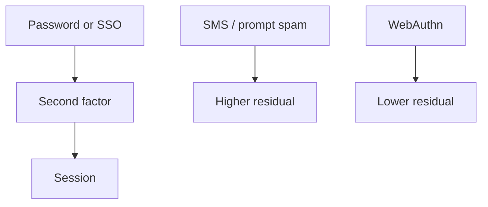

import { ConceptTemplate } from '@/features/kb/components/templates/ConceptTemplate'
import { Callout } from '@/features/kb/components/mdx/Callout'
import { ComparisonTable } from '@/features/kb/components/mdx/ComparisonTable'

export default function Layout({ children }) {
  return (
    <ConceptTemplate title="Multi-Factor Authentication">
      {children}
    </ConceptTemplate>
  )
}

**Multi-factor authentication (MFA)** asks for a second, independent factor after (or with) the password. A phished or stuffed password should die at the second check. Not all MFA is equal: **SMS and prompt-bombing** fail more often than **phishing-resistant** WebAuthn keys.

## 1. Deep Dive and Mechanics

**Factors.** Knowledge (password), possession (key, TOTP device), inherence (biometric that unlocks a key). Two passwords are not two factors.

**Phishing.** OTP and push can be relayed in real time. WebAuthn binds the origin; a fake site cannot complete the ceremony. Admins and email get that first.

**Recovery.** The backup code is a factor. Ship codes offline, rate-limit, and watch for recovery abuse. A helpdesk that resets MFA from a phone call is the new weak factor.

<Callout icon="warning" title="MFA fatigue is a real bypass">
If you spam-push until the user hits approve, you built an availability attack on attention. Number matching and WebAuthn fix the class.
</Callout>

## 2. Mathematical / Theoretical Foundation

Independence of factors is the claim: compromising one channel should not yield the other. SMS rides the phone network (SIM-swap). TOTP is a shared secret (phishable). WebAuthn is origin-bound public-key challenge-response. Residual risk is recovery flows and session theft after a good MFA.

<ComparisonTable
  headers={['Method', 'Phish resistant', 'Notes']}
  rows={[
    ['SMS', 'No', 'SIM-swap, delay'],
    ['TOTP', 'No', 'Better than SMS'],
    ['Push + number match', 'No', 'Beats fatigue somewhat'],
    ['WebAuthn / FIDO2', 'Yes', 'Prefer for privileged'],
  ]}
/>

## 3. Real-World Implementation

```text
# Workforce MFA
# - All users: at least TOTP or push with number match
# - Admins, email, VPN: hardware key or platform passkey
# - Recovery: cached codes, not "reset via helpdesk chat"
```

Consumer apps should offer passkeys and keep OTPs as fallback with tight risk checks.

## 4. Visualizations



## 5. Interview Prep

**Q: Is MFA required?**
**A:** For any network that faces the internet, treat it as yes. Privileged roles: phishing-resistant.

**Q: Why not SMS?**
**A:** The phone number is a weak, transferable authenticator.

**Q: Does MFA stop session theft?**
**A:** Not by itself. You still need cookie hygiene, binding, and revoke-all.

## 6. Production Use Cases

- **IdP** enrollment for the whole company.
- **Customer banking** step-up.
- **Cloud consoles** with hardware keys.

<Callout icon="tip" title="Measure coverage, not policy PDFs">
Percent of privileged sign-ins that used WebAuthn is the real control.
</Callout>
