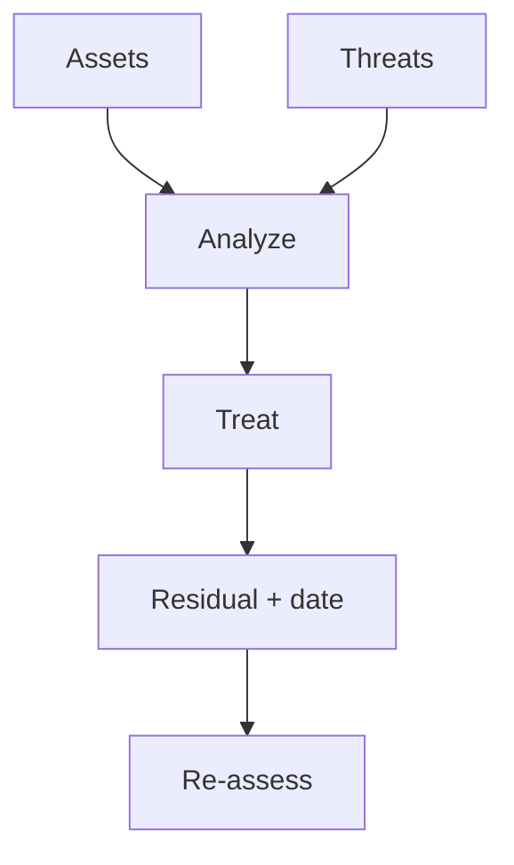

import { ConceptTemplate } from '@/features/kb/components/templates/ConceptTemplate'
import { Callout } from '@/features/kb/components/mdx/Callout'
import { ComparisonTable } from '@/features/kb/components/mdx/ComparisonTable'

export default function Layout({ children }) {
  return (
    <ConceptTemplate title="Risk Assessment">
      {children}
    </ConceptTemplate>
  )
}

A **risk assessment** turns anxiety into a list: asset, threat, vulnerability, likelihood, impact, and treatment. It is how you spend a finite budget. A 40-tab spreadsheet nobody updates is not an assessment. A one-page register with owners and dates can be.

## 1. Deep Dive and Mechanics

**Identify.** Assets and data classes, threats that matter to you (not a movie), and existing controls.

**Analyze.** Qualitative matrices (low/med/high) or quantitative models (FAIR) when you have frequency data. Write assumptions. Fake precision is worse than "high, we think."

**Treat.** Mitigate, transfer (insurance, vendor), avoid (do not offer the feature), or accept with a named executive and an expiry. Then re-assess after major change.

<Callout icon="info" title="Acceptance is a decision, not a shrug">
If nobody can sign the residual, you did not finish the assessment.
</Callout>

## 2. Mathematical / Theoretical Foundation

Expected loss is likelihood times impact when both are estimated honestly. Most cyber events are sparse, so qualitative bands plus scenarios work better than a fake dollar to three decimals. Sensitivity ("if this assumption is wrong, the rank flips") is the adult output. Aggregation across a register is not a single "risk score" you can average.

<ComparisonTable
  headers={['Method', 'Best when', 'Failure']}
  rows={[
    ['Qual matrix', 'Sparse data, speed', 'Everything is "high"'],
    ['Scenario / bow-tie', 'One jewel', 'Fanfic'],
    ['FAIR-style', 'Loss data exists', 'Garbage inputs'],
    ['Control checklist', 'Compliance', 'Misses novel threats'],
  ]}
/>

## 3. Real-World Implementation

```text
# Register row
# Asset: customer DB
# Threat: stolen cloud key
# Current: long-lived key in CI
# Treatment: OIDC role, 90 days, owner=platform
# Residual: accepted by CTO until then
```

Review accepted items on a calendar. Eternal acceptance is shadow policy.

## 4. Visualizations



## 5. Interview Prep

**Q: Risk vs vulnerability?**
**A:** A vulnerability is a weakness. Risk is the chance and impact of a threat using it against an asset.

**Q: Why not only CVSS?**
**A:** CVSS ignores your data and your exposure. A critical on an isolated lab is not a critical on the payment API.

**Q: How often?**
**A:** Enterprise register at least annually and on significant change. Product risks at design time.

## 6. Production Use Cases

- **Board** residual-risk packs.
- **New product** go-live gates.
- **Vendor** onboarding.

<Callout icon="tip" title="Write the scenario in a sentence">
"A contractor laptop is stolen while unlocked" is assessable. "Cyber risk" is not.
</Callout>
