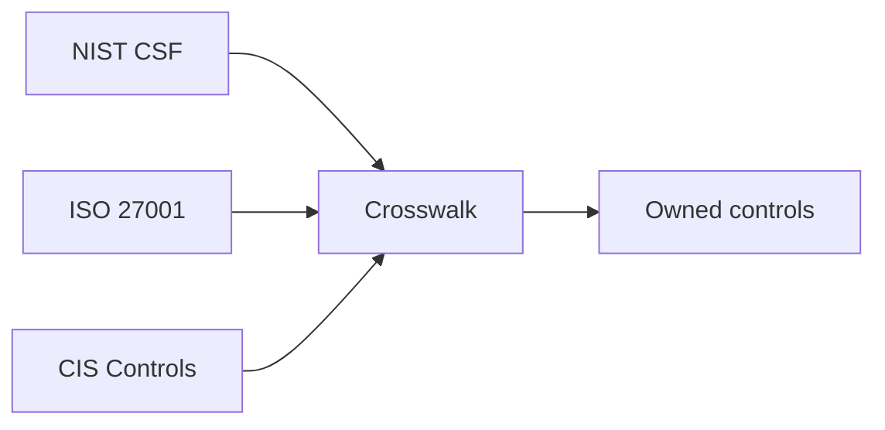

import { ConceptTemplate } from '@/features/kb/components/templates/ConceptTemplate'
import { Callout } from '@/features/kb/components/mdx/Callout'
import { ComparisonTable } from '@/features/kb/components/mdx/ComparisonTable'

export default function Layout({ children }) {
  return (
    <ConceptTemplate title="Security Frameworks">
      {children}
    </ConceptTemplate>
  )
}

A **security framework** is a structured list of outcomes or controls you can adopt, map, and audit. **NIST CSF** talks outcomes. **ISO 27001** is a certifiable ISMS. **CIS Controls** is a prioritized technical starter list. Pick a backbone and crosswalk the rest so engineers do not run three religions.

## 1. Deep Dive and Mechanics

**Adopt.** Choose CSF or ISO as the language for the board. Use CIS as the first-year technical backlog (inventory, backups, MFA).

**Map.** Each real control (SSO, EDR, backup test) gets one row that points at CSF categories, ISO Annex A, and CIS items. Evidence lives on that row.

**Avoid.** Buying a GRC tool before you have owners. Copy-pasting all of 800-53 into a startup wiki.

<Callout icon="info" title="Frameworks do not patch servers">
They tell you which conversations to have. The work is still IAM, logging, and restores.
</Callout>

## 2. Mathematical / Theoretical Foundation

Frameworks are taxonomies. A crosswalk is a many-to-many relation between statements. Coverage is the fraction of in-scope statements with an owner and evidence. Tiers and maturity models are ordinal; do not average them into 3.7.

<ComparisonTable
  headers={['Framework', 'Shape', 'You get']}
  rows={[
    ['NIST CSF', 'Outcomes', 'Board language'],
    ['ISO 27001', 'ISMS + audit', 'Certificate'],
    ['CIS Controls', 'Prioritized tech', 'Year-one backlog'],
    ['800-53', 'Deep catalog', 'Fed / high assurance'],
  ]}
/>

## 3. Real-World Implementation

```text
# Crosswalk row
# Control: weekly backup restore test
# CSF: Recover
# ISO: backup controls
# CIS: data recovery
# Evidence: ticket with screenshot and date
```

One owner per control. "Security team" is not an owner.

## 4. Visualizations



## 5. Interview Prep

**Q: Which should we start with?**
**A:** CIS for technical hygiene, CSF for the story, ISO if customers demand a certificate.

**Q: CSF vs ISO?**
**A:** CSF is voluntary outcomes. ISO is a certifiable management system. You can do both with one set of controls.

**Q: Are frameworks legally required?**
**A:** Sometimes by contract or sector. Often they are how you prove due care.

## 6. Production Use Cases

- **First security program** at a growing SaaS.
- **Enterprise** that must answer every RFP.
- **Public sector** suppliers aligning to NIST.

<Callout icon="tip" title="One backlog, many labels">
Engineers get tickets. Auditors get mappings. Do not make engineers read all three catalogs.
</Callout>
