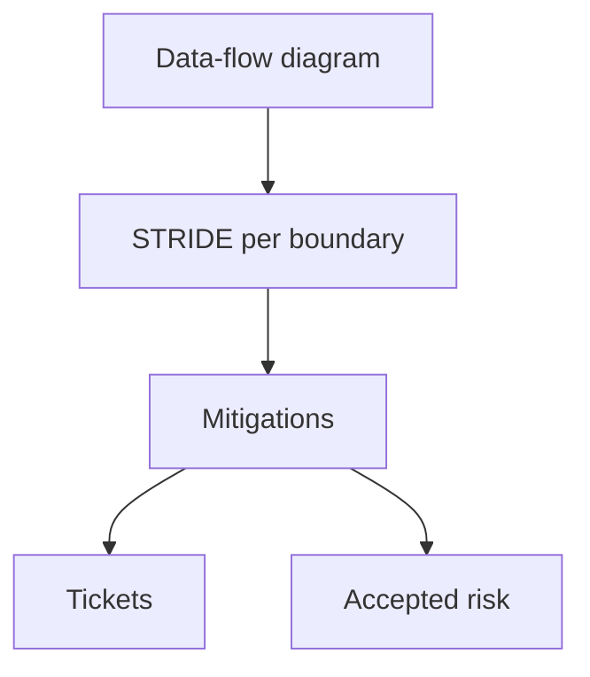

import { ConceptTemplate } from '@/features/kb/components/templates/ConceptTemplate'
import { Callout } from '@/features/kb/components/mdx/Callout'
import { ComparisonTable } from '@/features/kb/components/mdx/ComparisonTable'

export default function Layout({ children }) {
  return (
    <ConceptTemplate title="Threat Modelling (STRIDE, DREAD)">
      {children}
    </ConceptTemplate>
  )
}

**Threat modelling** is sitting with a diagram and asking "what can go wrong?" **STRIDE** is a mnemonic for threat categories (Spoofing, Tampering, Repudiation, Information disclosure, Denial of service, Elevation of privilege). **DREAD** is an old scoring mnemonic; many teams now prefer simpler severity or attack-tree notes. The deliverable is **mitigations in the design**, not a wallpaper matrix.

## 1. Deep Dive and Mechanics

Draw the data-flow: principals, processes, stores, trust boundaries. For each boundary, walk STRIDE. Write a mitigation or an accepted risk. Do this when the design can still change.

**STRIDE examples at a high level.** Spoofing: missing authn. Tampering: unsigned webhooks. Repudiation: no audit. Disclosure: extra fields in logs. DoS: unbounded work. Elevation: missing authz.

**DREAD.** Damage, Reproducibility, Exploitability, Affected users, Discoverability — historically used to score. It is subjective and easy to game. If you score, keep a short rubric and a human reviewer.

<Callout icon="warning" title="A model that never changes a design was theater">
If every threat is "covered by AWS," start over.
</Callout>

## 2. Mathematical / Theoretical Foundation

A threat model is a graph plus a set of unwanted traces. STRIDE is a coverage heuristic for categories, not a proof. Attack trees multiply AND/OR costs. Scoring schemes are ordinal at best. The scientific habit is listing assumptions (who is trusted, what the IdP guarantees).

<ComparisonTable
  headers={['Method', 'Gives you', 'Watch-out']}
  rows={[
    ['STRIDE on DFDs', 'Category coverage', 'Shallow if rushed'],
    ['Abuse stories', 'Product language', 'Miss structural issues'],
    ['DREAD score', 'A number', 'False precision'],
    ['Attack tree', 'Path costs', 'Combinatorial blow-up'],
  ]}
/>

## 3. Real-World Implementation

```text
# Session notes
# Diagram link, trust boundaries
# Threat: spoofed webhook
# Mitigation: HMAC + timestamp, deny replay
# Owner: payments API, before GA
```

Store the notes next to the design doc. Update on significant change.

## 4. Visualizations



## 5. Interview Prep

**Q: When do you threat model?**
**A:** New trust boundaries, new data classes, or new internet exposure — before code freeze.

**Q: STRIDE vs PASTA vs OCTAVE?**
**A:** Different wrappers. STRIDE is the one engineers remember. Consistency beats brand.

**Q: Is DREAD still recommended?**
**A:** Many Microsoft-era teams dropped it for simpler ratings. Use it only if your org still speaks it.

## 6. Production Use Cases

- **New payment** or export features.
- **SSO / webhook** integrations.
- **Moving a service** from private to public.

<Callout icon="tip" title="One hour with a whiteboard beats a 30-page template">
Invite the people who will write the code and the people who will on-call it.
</Callout>
