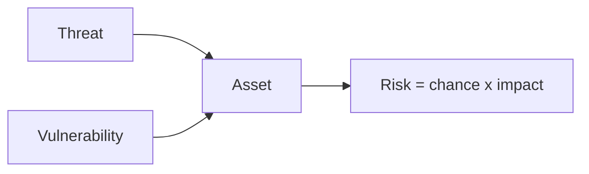

import { ConceptTemplate } from '@/features/kb/components/templates/ConceptTemplate'
import { Callout } from '@/features/kb/components/mdx/Callout'
import { ComparisonTable } from '@/features/kb/components/mdx/ComparisonTable'

export default function Layout({ children }) {
  return (
    <ConceptTemplate title="Threats">
      {children}
    </ConceptTemplate>
  )
}

A **threat** is a potential cause of harm: a criminal gang, a careless admin, a fire, a hostile nation-state, or a dependency that goes bankrupt. Threats are not vulnerabilities (those are weaknesses) and not risks (those include likelihood and impact). You cannot "patch a threat." You can reduce exposure and impact.

## 1. Deep Dive and Mechanics

**Name them.** External criminals (ransomware, fraud), insiders (malicious or merely sloppy), supply chain, physical, and environmental. Be specific enough to design ("commodity ransomware" vs "targeted theft of source").

**Intent vs capability.** A script kid and an APT are different budgets. Your bank's threat is not a blog's threat. Intel and sector notes keep the list honest.

**Pair with assets.** A threat without an asset is a headline. "Ransomware against our file shares and backups" is a design input.

<Callout icon="info" title="Honest threats include accidents">
Most availability losses are bugs, expired certs, and deleted disks — not genius adversaries.
</Callout>

## 2. Mathematical / Theoretical Foundation

Threat modeling languages treat a threat as an agent with goals and resources. Capability can be thought of as a budget (time, money, access). Likelihood in the risk equation is P(threat acts and succeeds | controls). Do not assign movie-plot likelihoods without a base rate.

<ComparisonTable
  headers={['Threat class', 'Typical goal', 'Primary control theme']}
  rows={[
    ['Commodity crime', 'Cash / ransomware', 'Patch, MFA, backups'],
    ['Fraud / abuse', 'Money movement', 'Authz, velocity, step-up'],
    ['Insider', 'Data or sabotage', 'Least priv, audit'],
    ['Supply chain', 'Trust abuse', 'Pin, sign, isolate CI'],
  ]}
/>

## 3. Real-World Implementation

```text
# Threat statement
# Who: commodity ransomware operators
# What they want: encrypt file shares, pressure via stolen email
# We care because: 3-day outage + extortion
# So we: immutable backups, MFA, EDR, segmented shares
```

Review the list when the business adds a new data class (health, payments, kids).

## 4. Visualizations



## 5. Interview Prep

**Q: Threat vs vulnerability vs risk?**
**A:** Threat is the source of harm. Vulnerability is the weakness. Risk is the combination with impact.

**Q: Do we need named APT groups?**
**A:** Only if it changes a control. Sector-generic "capable criminal" is enough for most SaaS.

**Q: Are users a threat?**
**A:** Users are a source of error and sometimes abuse. Design for that without contempt.

## 6. Production Use Cases

- **Risk register** inputs.
- **Tabletop** scenarios.
- **Product** abuse cases (fraud).

<Callout icon="tip" title="Write threats your engineers can design against">
"Nation-state" is vague. "Someone with a phished admin session" is actionable.
</Callout>
