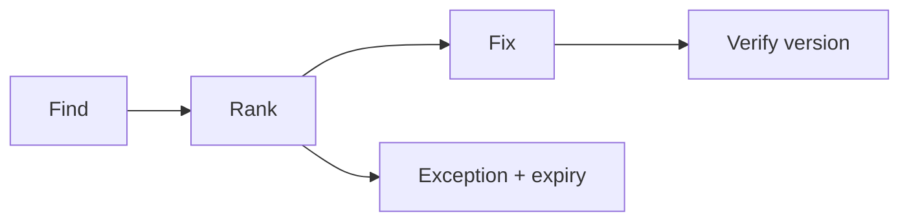

import { ConceptTemplate } from '@/features/kb/components/templates/ConceptTemplate'
import { Callout } from '@/features/kb/components/mdx/Callout'
import { ComparisonTable } from '@/features/kb/components/mdx/ComparisonTable'

export default function Layout({ children }) {
  return (
    <ConceptTemplate title="Vulnerabilities">
      {children}
    </ConceptTemplate>
  )
}

A **vulnerability** is a weakness: a missing authz check, an outdated library, a default password, a public bucket. **Vulnerability management** is the factory that finds, ranks, and closes them. A CVE number is one kind. A logic bug with no CVE is still a vulnerability.

## 1. Deep Dive and Mechanics

**Find.** Scanners, SCA in CI, pentests, bounties, and code review. Coverage matters more than the loudest tool.

**Rank.** CVSS is a starting hint. Add exposure (internet-facing?), data class, and whether a fix exists. A critical on an isolated lab is not today's fire.

**Close.** Patch, config change, or compensating control with an expiry. Verify with a version, not a vibe. Exceptions are risk acceptances.

<Callout icon="warning" title="A finding without an owner is decoration">
Every open item needs a team, a ticket, and a date.
</Callout>

## 2. Mathematical / Theoretical Foundation

The backlog is a queue with arrivals (new CVEs, new code) and service rate (patch capacity). SLAs are policy on expected loss. CVSS base score ignores your environment; environmental metrics exist for a reason. Zero-days are arrivals with incomplete information — mitigations and depth matter.

<ComparisonTable
  headers={['Source', 'Finds', 'Misses']}
  rows={[
    ['Infra scan', 'Known host CVEs', 'App logic'],
    ['SCA', 'Library CVEs', 'Your code'],
    ['SAST / review', 'Some code bugs', 'Runtime config'],
    ['Human test', 'Impact / logic', 'Complete coverage'],
  ]}
/>

## 3. Real-World Implementation

```text
# SLA sketch
# Internet-facing critical: 7 days or mitigate
# Internal high: 30 days
# No-fix vendor: compensate + monthly review
# Evidence: version pin in the image or package lock
```

SCA should fail CI on new criticals in production dependencies, with a documented ignore that expires.

## 4. Visualizations



## 5. Interview Prep

**Q: Vulnerability vs exploit?**
**A:** Weakness vs a working use. Patch vulns even when no exploit is public.

**Q: How do you handle a storm of CI findings?**
**A:** Baseline, fix new ones, burn down the old by risk, and do not hide the dashboard.

**Q: Is a misconfiguration a vulnerability?**
**A:** Yes. CWE and CIS treat many configs as weaknesses.

## 6. Production Use Cases

- **Weekly** vuln review with engineering.
- **Container** base-image rebuilds.
- **Customer** questionnaires that ask for SLA, not zero findings.

<Callout icon="tip" title="Ship the patch pipeline before the scanner">
Finding 4,000 issues on day one is how programs die. Find, then be able to ship.
</Callout>
