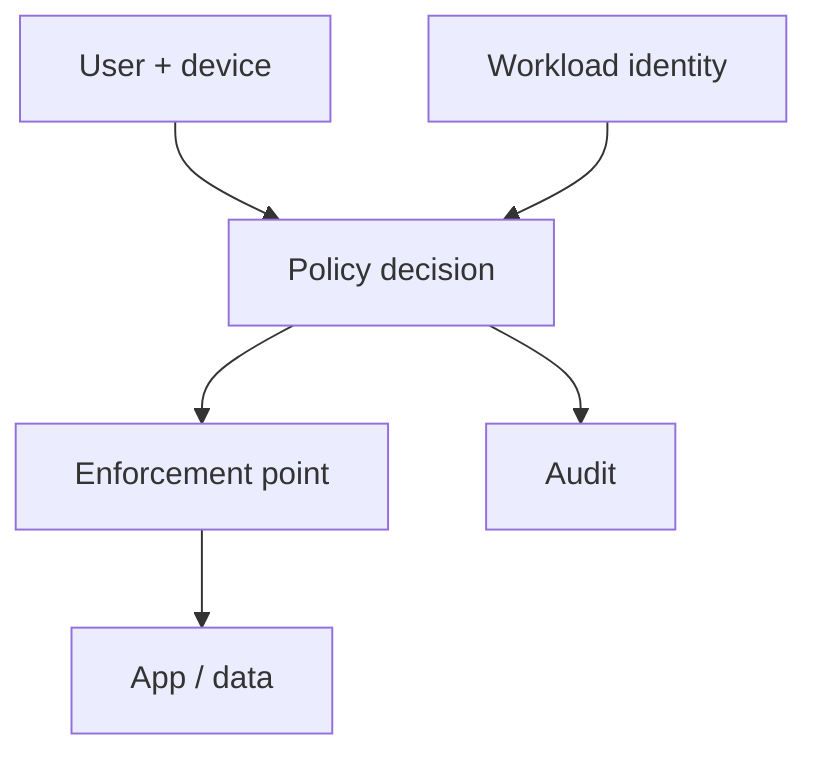

import { ConceptTemplate } from '@/features/kb/components/templates/ConceptTemplate'
import { Callout } from '@/features/kb/components/mdx/Callout'
import { ComparisonTable } from '@/features/kb/components/mdx/ComparisonTable'

export default function Layout({ children }) {
  return (
    <ConceptTemplate title="Zero Trust">
      {children}
    </ConceptTemplate>
  )
}

**Zero Trust** assumes the network is hostile — including the office LAN. Access is decided by **identity, device, and policy** on each request. A VPN that dumps you onto a flat /16 is the old model. Zero Trust is not a product SKU. It is a way to draw trust boundaries around users, services, and data.

## 1. Deep Dive and Mechanics

**Authenticate strongly.** SSO, phishing-resistant MFA, and workload identities.

**Authorize narrowly.** Per app or per RPC, not "inside equals trusted." Device posture (managed, encrypted, patched) can be an input.

**Observe.** Every decision is logged. Lateral movement has no soft center to wander.

**Migrate.** Start with remote access (ZTNA replacing fat VPN), then service-to-service, then admin planes. Do not boil the ocean.

<Callout icon="info" title="Zero Trust still needs backups and patching">
It relocates the perimeter to identity. It does not repeal ransomware or supply-chain risk.
</Callout>

## 2. Mathematical / Theoretical Foundation

Classic perimeter security is a coarse allow based on network location. Zero Trust is allow(principal, device, action, resource, context) evaluated continuously (session risk can drop). NIST SP 800-207 describes the policy decision and enforcement points. Failure modes: a god-token IdP, or posture checks that are client-side theater.

<ComparisonTable
  headers={['Old', 'Zero Trust-ish', 'Still required']}
  rows={[
    ['Corp LAN trust', 'Per-app ZTNA', 'EDR and patch'],
    ['Flat VPN', 'SSO + device', 'Logging'],
    ['Hard shell, soft center', 'Micro-seg + identity', 'Backups'],
    ['Long VPN cert', 'Short session + step-up', 'IR revoke'],
  ]}
/>

## 3. Real-World Implementation

```text
# First year
# - SSO everywhere, kill local passwords
# - ZTNA for a few apps; shrink the VPN
# - Device posture for admin apps
# - Service identities; no long-lived keys in CI
```

Measure standing VPN group membership. Drive it toward zero.

## 4. Visualizations



## 5. Interview Prep

**Q: Is Zero Trust "no VPN"?**
**A:** Often ZTNA replaces a fat VPN. Some site-to-site links remain. The idea is no implied trust from IP.

**Q: Zero Trust vs least privilege?**
**A:** Least privilege is the permission rule. Zero Trust is where and how often you evaluate it.

**Q: Why do projects stall?**
**A:** They buy a gateway and never inventory apps or fix IdP hygiene.

## 6. Production Use Cases

- **Remote workforce** access.
- **Contractor** access to one app, not the LAN.
- **Service mesh** identities in the datacenter.

<Callout icon="tip" title="Start with the admin plane">
If the cloud console and the IdP are not Zero Trust, the rest is decoration.
</Callout>
