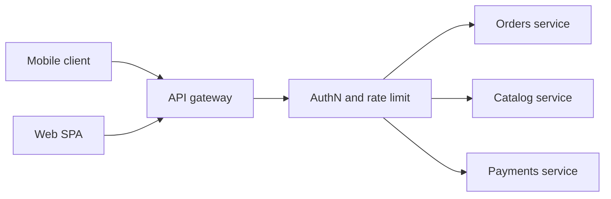

import { ConceptTemplate } from '@/features/kb/components/templates/ConceptTemplate'
import { Callout } from '@/features/kb/components/mdx/Callout'
import { ComparisonTable } from '@/features/kb/components/mdx/ComparisonTable'

export default function Layout({ children }) {
  return (
    <ConceptTemplate title="API Gateways">
      {children}
    </ConceptTemplate>
  )
}

**API gateways** sit between clients and a fleet of backend services. The phone app, web SPA, and partner integration call one hostname. The gateway terminates TLS, checks identity, applies policy, and fans the request out to the right owners. Without it, every client must know every service address, version, and auth dance.

## 1. Deep Dive and Mechanics

A gateway is a reverse proxy with opinions. It matches path, host, and sometimes headers, then forwards to an upstream cluster. Cross-cutting work lives here so each microservice does not reimplement it.

**Typical duties.** JWT or mTLS authentication. Per-key and per-IP rate limits. Request size caps. Header rewriting. Canary routing. Protocol translation (REST in, gRPC out). Optional BFF-style aggregation so a dashboard is one round trip, not twelve.

**Where it must not live.** Business rules that only one domain understands. A payments team should own refund logic. If the gateway starts encoding product policy, you have built a distributed monolith with a single choke point.

<Callout icon="warning" title="The gateway is in the critical path">
Every extra hop, regex, and JSON rewrite adds tail latency. Profile p99 on the gateway itself, not only on upstreams.
</Callout>

## 2. Mathematical / Theoretical Foundation

Think of the gateway as a function G that maps an inbound request to a set of upstream calls and a merge function. Fan-out of k services in parallel is bounded by the slowest of those k plus gateway overhead. Availability of the facade is the product of gateway availability and the availability of the required subset of backends (unless you degrade).

Rate limiting is usually a token bucket or sliding window per key. The math is local until you shard counters across gateway replicas, at which point you trade exactness for speed.

<ComparisonTable
  headers={['Layer', 'Sees payload', 'Typical job', 'Example']}
  rows={[
    ['L4 load balancer', 'No', 'TCP fan-out', 'NLB, HAProxy TCP'],
    ['API gateway', 'Yes', 'Auth, route, shape', 'Kong, Apigee, AWS API GW'],
    ['Service mesh sidecar', 'Yes east-west', 'mTLS, retries', 'Envoy, Linkerd'],
    ['BFF', 'Yes', 'Client-specific aggregate', 'GraphQL or mobile BFF'],
  ]}
/>

## 3. Real-World Implementation

```nginx
# Conceptual gateway location: auth + route, not business logic
location /v1/orders/ {
    auth_request /_int/jwt;
    limit_req zone=per_key burst=20 nodelay;
    proxy_pass http://orders_upstream;
    proxy_set_header X-Request-Id $request_id;
}
```

Keep JWT validation in a sidecar or auth_request so the route block stays short. Aggregation belongs in a dedicated BFF service if it grows beyond a few fan-outs.

## 4. Visualizations



## 5. Interview Prep

**Q: Gateway versus load balancer?**
**A:** A balancer often works at L4 and is payload-blind. A gateway parses HTTP, applies identity and policy, and may rewrite or aggregate. Many production edges are both: L4 in front, L7 gateway behind.

**Q: Why not let every client call services directly?**
**A:** Clients then own discovery, versioning, CORS, auth, and fan-out. Mobile binaries cannot change as fast as the backend. The gateway is the stable contract.

**Q: What fails first at scale?**
**A:** Shared connection pools, oversized request bodies, and synchronous aggregation of a slow dependency. Time out and degrade rather than wait for every backend.

## 6. Production Use Cases

- **Public API products** with key-based quotas and developer portals.
- **Mobile BFFs** that collapse several microservice calls into one payload.
- **Enterprise ingress** that terminates mTLS from partners and maps to internal gRPC.

<Callout icon="tip" title="Version the external contract, not the internals">
Keep /v1 stable. Split, merge, or rewrite upstreams behind the gateway without forcing app-store releases.
</Callout>
