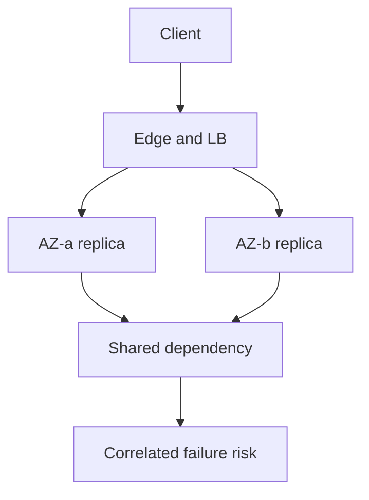

import { ConceptTemplate } from '@/features/kb/components/templates/ConceptTemplate'
import { Callout } from '@/features/kb/components/mdx/Callout'
import { ComparisonTable } from '@/features/kb/components/mdx/ComparisonTable'

export default function Layout({ children }) {
  return (
    <ConceptTemplate title="Availability">
      {children}
    </ConceptTemplate>
  )
}

**Availability** is the fraction of time a system does useful work for a caller who plays by the rules. The classroom formula is uptime divided by uptime plus downtime. In production you measure successful requests against valid attempts, because a process can be "up" and still fail every checkout.

## 1. Deep Dive and Mechanics

Nines are a budget, not a slogan. Two nines allow days of downtime a year. Four nines allow about an hour. Five nines are minutes. Each extra nine usually costs an order of magnitude more architecture: multi-AZ, then multi-region, then active-active with conflict rules.

**What counts as down.** A 500 storm, a hung connection pool, and a dependency timeout that surfaces as errors all burn the same error budget. Planned maintenance counts unless you have a defined exclusion in the SLO.

**How you buy it.** Redundant instances behind a balancer. Health checks that actually probe the dependency you care about. Fast failover. Isolation so one noisy tenant cannot take the fleet. Dependency budgets so a cache miss does not cascade.

<Callout icon="warning" title="Availability is not the same as correctness">
Serving stale balances at 100 percent uptime can still be a Sev-1. Pair availability SLOs with freshness or consistency SLOs where money moves.
</Callout>

## 2. Mathematical / Theoretical Foundation

If independent components are in series, availability multiplies: A_sys = A1 * A2 * A3. Three services at 99.9 percent yield about 99.7 percent if any failure fails the request. Parallel redundancy with failover is 1 minus the product of unavailabilities, assuming failures are independent (they rarely are: shared disks, shared config, shared people).

Error budgets translate nines into allowed failed requests in a window. A 99.9 percent monthly SLO on 100 million calls allows 100 thousand failures. Burn-rate alerts watch how fast you spend that budget.

<ComparisonTable
  headers={['Target', 'Downtime per year', 'Typical posture', 'Cost shape']}
  rows={[
    ['99 percent', 'About 3.7 days', 'Single region, cold spare', 'Low'],
    ['99.9 percent', 'About 8.8 hours', 'Multi-AZ, automated failover', 'Moderate'],
    ['99.99 percent', 'About 53 minutes', 'Multi-region or very tight HA', 'High'],
    ['99.999 percent', 'About 5 minutes', 'Active-active, practiced failover', 'Very high'],
  ]}
/>

## 3. Real-World Implementation

```python
def availability(successes, valid_attempts):
    if valid_attempts <= 0:
        return 0.0
    return successes / valid_attempts

# 99.9 percent monthly SLO on 10_000_000 valid requests
budget = 10_000_000 * (1 - 0.999)
print('allowed failures', int(budget))
```

Exclude bot traffic and 404s for unknown routes if the SLO says so. Do not exclude "just the incident."

## 4. Visualizations



## 5. Interview Prep

**Q: How many nines do we need?**
**A:** Match the cost of being down. An internal report job can live at 99 percent. Card authorization cannot. Write the SLO from user pain, then design to it.

**Q: Why is 99.9 times 99.9 not 99.9?**
**A:** Series dependencies multiply. The user journey crosses gateway, app, and database. The journey SLO is worse than any one box unless you hide failures.

**Q: High availability versus disaster recovery?**
**A:** HA is short-term failover inside a design (AZ loss). DR is rebuilding after a region or data-loss event. RTO and RPO are DR numbers; nines are usually HA plus process.

## 6. Production Use Cases

- **Checkout and login** paths with tight SLOs and multi-AZ databases.
- **Control planes** (Kubernetes API, IAM) that must outlive any single worker pool.
- **Status pages and feature flags** that stay up so you can degrade the main app honestly.

<Callout icon="tip" title="Measure the user journey">
A green /health that pings localhost lies. Probe the query or write the user actually needs.
</Callout>
