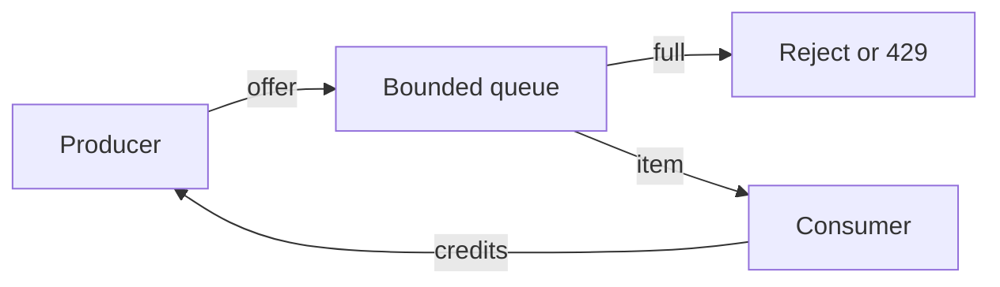

import { ConceptTemplate } from '@/features/kb/components/templates/ConceptTemplate'
import { Callout } from '@/features/kb/components/mdx/Callout'
import { ComparisonTable } from '@/features/kb/components/mdx/ComparisonTable'

export default function Layout({ children }) {
  return (
    <ConceptTemplate title="Backpressure">
      {children}
    </ConceptTemplate>
  )
}

**Backpressure** is how a slow consumer tells a fast producer to ease off. Without it, queues grow without bound, heap memory dies, and latency goes non-linear. With it, the system either slows intake, drops low-value work, or fails fast so callers can retry elsewhere.

## 1. Deep Dive and Mechanics

There are three honest responses to overload: **block** the producer, **bounded-queue and reject**, or **shed** (drop or sample). Blocking is simple inside one process (a blocking queue). Across the network you need explicit windows, HTTP 429, gRPC RESOURCE_EXHAUSTED, or a pull model where the consumer asks for the next batch.

**Push versus pull.** Kafka consumers pull; a stuck consumer does not force brokers to buffer infinite application memory. HTTP APIs are push: the client decides to send. Then the server must refuse or the edge must throttle.

**Propagation.** True backpressure walks upstream. If service C is slow, B must stop calling C as fast, and A must see B slow down. Circuit breakers and bulkheads help, but they are cousins, not substitutes: they isolate failure, they do not always slow the original producer.

<Callout icon="warning" title="An unbounded channel is a time bomb">
In-memory queues without a max length convert a downstream outage into an OOM. Bound the queue and define what happens when it is full.
</Callout>

## 2. Mathematical / Theoretical Foundation

Little's law: L = lambda * W. If arrival rate lambda exceeds service rate mu, queue length grows without limit. Stability requires lambda less than mu, or a shed policy that throws work away so the admitted lambda stays under mu.

Windowed protocols (TCP, HTTP/2 flow control, Reactive Streams request-n) keep in-flight work under a credit budget. Credits are the discrete form of backpressure.

<ComparisonTable
  headers={['Strategy', 'Producer sees', 'Data loss', 'Use when']}
  rows={[
    ['Block / credit window', 'Slowdown', 'None if it waits', 'In-process or trusted clients'],
    ['Bounded reject', '429 or error', 'None of admitted work', 'Public APIs'],
    ['Drop oldest / sample', 'Silence or metric', 'Yes', 'Telemetry, best-effort streams'],
    ['Load shed by priority', 'Low-pri fail', 'Low-pri only', 'Mixed criticality'],
  ]}
/>

## 3. Real-World Implementation

```python
from collections import deque

class BoundedInbox:
    def __init__(self, cap):
        self.q = deque()
        self.cap = cap

    def offer(self, item):
        if len(self.q) >= self.cap:
            return False  # caller must 429 or retry later
        self.q.append(item)
        return True

    def take(self):
        return self.q.popleft() if self.q else None
```

Return 429 with Retry-After on False. Do not silently enqueue to disk unless that disk path is itself bounded and monitored.

## 4. Visualizations



## 5. Interview Prep

**Q: Is a message broker backpressure?**
**A:** Only if produce is blocked or rejected when the broker or consumer lag hits a limit. A broker with infinite retention and a deaf consumer is delayed disaster, not flow control.

**Q: Backpressure versus rate limiting?**
**A:** Rate limits are a priori policy (N per key). Backpressure is dynamic: it reacts to actual queue depth or RTT. You usually want both.

**Q: Why does TCP not save my API?**
**A:** TCP windows protect the connection, not your thread pool or downstream database. The app must bound its own concurrency.

## 6. Production Use Cases

- **Ingest APIs** that 429 when the write-ahead log or consumer lag crosses a threshold.
- **Stream processors** using Reactive Streams or async pull so a slow sink does not balloon heap.
- **Edge proxies** that limit in-flight requests per upstream.

<Callout icon="tip" title="Export queue depth as a golden signal">
Depth, age of head, and reject rate tell you whether backpressure is working or whether you are already in the red.
</Callout>
