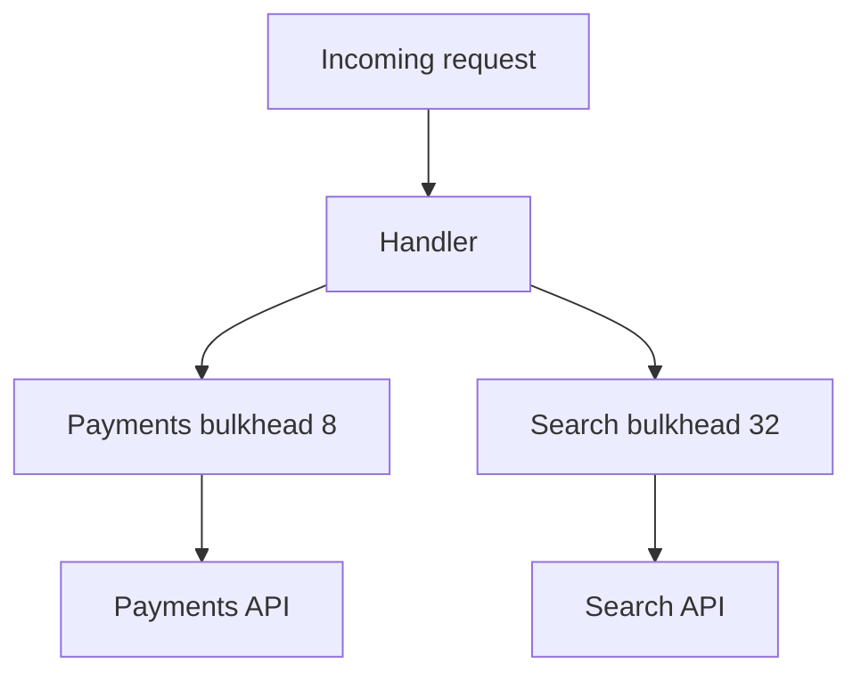

import { ConceptTemplate } from '@/features/kb/components/templates/ConceptTemplate'
import { Callout } from '@/features/kb/components/mdx/Callout'
import { ComparisonTable } from '@/features/kb/components/mdx/ComparisonTable'

export default function Layout({ children }) {
  return (
    <ConceptTemplate title="Bulkhead Pattern">
      {children}
    </ConceptTemplate>
  )
}

The **bulkhead pattern** borrows from ship design: watertight compartments keep one flooded hold from sinking the hull. In software you partition thread pools, connection pools, processes, or even clusters so that a stuck payments client cannot steal every worker from search.

## 1. Deep Dive and Mechanics

A typical service has one shared executor and one shared HTTP client. When a dependency hangs, every request thread blocks on it, health checks fail, and the instance is pulled from rotation — even for URLs that never touched the bad dependency.

**Isolation axes.** Separate thread pools or semaphores per dependency. Separate connection pools. Separate JVM or container for a risky plugin. Separate node pool or cell for a noisy tenant. The finer the isolation, the more unused capacity you waste; that is the tax.

**Combine with timeouts.** A bulkhead without a timeout still fills: all eight payments permits block forever. Timeouts free the permit. Circuit breakers stop sending once the compartment is clearly unhealthy.

<Callout icon="info" title="Bulkheads waste capacity on purpose">
Idle threads in the search pool while payments is slammed is success, not waste. Shared pools maximize utilization until the first outage.
</Callout>

## 2. Mathematical / Theoretical Foundation

Model each dependency as a queue with capacity C_i (permits). Loss of dependency i saturates only C_i workers. Remaining capacity is Total - C_i for everyone else. Shared-pool blast radius is Total.

This is the same math as multi-class queues with reserved servers. You are choosing a utilization penalty to cap correlated blocking.

<ComparisonTable
  headers={['Isolation', 'Blast radius', 'Ops cost', 'Typical tool']}
  rows={[
    ['Shared pool', 'Whole process', 'Lowest', 'Default HTTP client'],
    ['Semaphore per dep', 'That dep pool', 'Low', 'Resilience4j, failsafe'],
    ['Process / container', 'That process', 'Medium', 'Sidecar, separate pod'],
    ['Cell or cluster', 'That cell', 'High', 'Shard by tenant'],
  ]}
/>

## 3. Real-World Implementation

```python
import threading

class Bulkhead:
    def __init__(self, limit):
        self.sem = threading.Semaphore(limit)

    def call(self, fn):
        if not self.sem.acquire(blocking=False):
            raise RuntimeError('bulkhead_full')
        try:
            return fn()
        finally:
            self.sem.release()

payments = Bulkhead(8)
search = Bulkhead(32)
```

Tune limits from concurrency = target_latency * offered_rate, then add headroom. Alert on bulkhead_full separately from dependency 5xx.

## 4. Visualizations



## 5. Interview Prep

**Q: Bulkhead versus circuit breaker?**
**A:** Bulkhead limits concurrent exposure. Circuit breaker stops calling after a failure threshold. Use both: the bulkhead caps the storm; the breaker short-circuits a dead dep.

**Q: Why not isolate every function?**
**A:** Too many tiny pools under-utilize hardware and create tuning hell. Isolate at failure domains: each network dependency, each tenant class, each disk.

**Q: How do you size the pool?**
**A:** Start from expected concurrency and timeout. If timeout is 200 ms and you want 400 payments QPS, you need about 80 in-flight, not 8. Measure, then reserve.

## 6. Production Use Cases

- **BFF or gateway** calling many backends with per-host executors.
- **Multi-tenant SaaS** cells so one customer import cannot starve interactive traffic.
- **Plugin platforms** where third-party code gets its own process and CPU quota.

<Callout icon="tip" title="Name the compartment in metrics">
bulkhead=payments, outcome=full is an actionable page. A generic thread-pool-exhausted is not.
</Callout>
