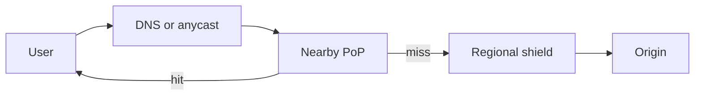

import { ConceptTemplate } from '@/features/kb/components/templates/ConceptTemplate'
import { Callout } from '@/features/kb/components/mdx/Callout'
import { ComparisonTable } from '@/features/kb/components/mdx/ComparisonTable'

export default function Layout({ children }) {
  return (
    <ConceptTemplate title="CDNs">
      {children}
    </ConceptTemplate>
  )
}

A **content delivery network (CDN)** is a fleet of points of presence that cache and sometimes compute at the edge. Users hit a nearby PoP. The PoP serves from cache or fetches from origin. The win is shorter RTT, lower origin IOPS, and a shield against naive floods.

## 1. Deep Dive and Mechanics

DNS or anycast maps the client to a PoP. The PoP looks up the object by URL, Vary headers, and cache key. Hits return immediately. Misses go to origin (or a regional shield) and populate the edge.

**What belongs on a CDN.** Immutable hashed assets (app.ab12.js). Images and video with long TTL. Public API GET responses that tolerate brief staleness. TLS termination and WAF rules. **What does not.** Personalized, authorization-sensitive HTML unless you vary the cache key correctly and accept the leak risk.

**Invalidation.** Purge by URL or tag when content changes. Immutable filenames with content hashes avoid purge races: new deploy = new URL.

<Callout icon="warning" title="Cache keys must include what changes the bytes">
Missing a cookie, Accept-Language, or auth context on a shared cache key serves User A the page of User B.
</Callout>

## 2. Mathematical / Theoretical Foundation

Hit ratio h means origin sees (1 - h) of requests plus revalidations. Origin offload is roughly h, minus uncacheable traffic. Latency is RTT_pop + (1 - h) * (RTT_origin + origin_time) on a simple model.

Capacity planning: edge storage versus working set. A tiny PoP cannot hold a long-tail catalog; expect a power-law of hits.

<ComparisonTable
  headers={['Asset', 'TTL posture', 'Key care', 'Origin load']}
  rows={[
    ['Hashed JS/CSS', 'Year, immutable', 'URL only', 'Near zero after warmup'],
    ['Product image', 'Days plus purge', 'URL plus size', 'Low'],
    ['Public GET API', 'Seconds to minutes', 'URL plus vary', 'Medium'],
    ['Authed HTML', 'Usually bypass', 'Dangerous if shared', 'High'],
  ]}
/>

## 3. Real-World Implementation

```
Cache-Control: public, max-age=31536000, immutable
# filename: main.9f3a2c.js  — content hash, never reuse

Cache-Control: public, max-age=60, stale-while-revalidate=30
# marketing homepage: short TTL, serve stale while origin refreshes
```

Pair short-TTL HTML with a shield PoP so thundering herds collapse to one origin fetch.

## 4. Visualizations



## 5. Interview Prep

**Q: CDN versus reverse proxy cache at origin?**
**A:** An origin cache helps one region. A CDN puts copies near users worldwide and absorbs geographic load. Many stacks use both.

**Q: How do you rotate a leaked asset?**
**A:** Change the content hash / URL. Purging a long-TTL object is best-effort across hundreds of PoPs; a new name is certain.

**Q: Can a CDN replace an API gateway?**
**A:** It can terminate TLS, WAF, and cache GETs. It is a poor place for complex per-tenant business aggregation. Use both when you need both.

## 6. Production Use Cases

- **SPA and mobile asset delivery** with hashed filenames.
- **Video and large-file download** via segmented objects and range requests.
- **API edge caching** for public catalog reads during launches.

<Callout icon="tip" title="Prefer immutable URLs over emergency purges">
Purge is a reliability feature, not a deploy strategy. Hash the content and let TTL be long.
</Callout>
