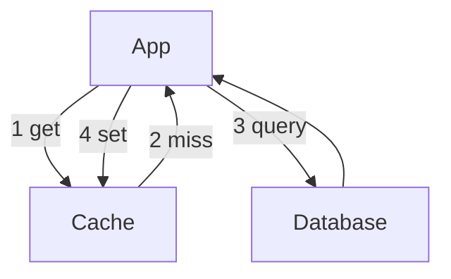

import { ConceptTemplate } from '@/features/kb/components/templates/ConceptTemplate'
import { Callout } from '@/features/kb/components/mdx/Callout'
import { ComparisonTable } from '@/features/kb/components/mdx/ComparisonTable'

export default function Layout({ children }) {
  return (
    <ConceptTemplate title="Caching Strategies">
      {children}
    </ConceptTemplate>
  )
}

**Caching strategies** decide who writes the cache, who reads it, and what happens on miss or on write. The wrong pattern is a consistency bug with a latency costume. The right one is a working set in fast memory and a database that sleeps.

## 1. Deep Dive and Mechanics

**Cache-aside (lazy).** App reads cache; on miss, loads DB, then fills cache. Writes go to DB and then delete or update the key. Simple and common. Risk: two writers race and restore stale data.

**Write-through.** App writes cache and DB in the same path (cache library or proxy writes DB). Reads are fast and the cache is never secretly behind on that key — at the cost of write latency.

**Write-back.** App writes cache; DB is updated later. Fast writes, risk of loss if the cache node dies before flush.

**Refresh-ahead / read-through.** A cache proxy knows how to load the DB. Clients always talk to the cache.

<Callout icon="warning" title="Invalidation is the hard part">
Every strategy still needs a story for updates, TTL, and stampede. A strategy name is not a complete design.
</Callout>

## 2. Mathematical / Theoretical Foundation

Expected read latency is h * L_cache + (1 - h) * L_miss. Hit rate h is a property of working-set size versus cache size and of key skew (Zipf). Write-heavy keys with tiny TTL have h near zero; do not cache them.

Stampede: if a hot key expires and N clients miss together, miss amplification is N. Probabilistic early expire or single-flight coalescing brings it back toward 1.

<ComparisonTable
  headers={['Strategy', 'Read path', 'Write path', 'Failure worry']}
  rows={[
    ['Cache-aside', 'App fills on miss', 'DB then evict', 'Stale fill race'],
    ['Write-through', 'Cache first', 'Cache and DB together', 'Write latency'],
    ['Write-back', 'Cache first', 'Cache then async DB', 'Lost dirty data'],
    ['Read-through', 'Library loads DB', 'Policy-dependent', 'Hidden coupling'],
  ]}
/>

## 3. Real-World Implementation

```python
def get_user(cache, db, user_id):
    key = 'user:' + user_id
    hit = cache.get(key)
    if hit is not None:
        return hit
    row = db.fetch_user(user_id)
    cache.set(key, row, ttl_s=60)
    return row

def update_user(cache, db, user_id, fields):
    db.update_user(user_id, fields)
    cache.delete('user:' + user_id)
```

Delete-on-write is safer than set-on-write when multiple columns and caches exist. Pair with short TTL as a backstop.

## 4. Visualizations



## 5. Interview Prep

**Q: Why is cache-aside so popular?**
**A:** The app already knows the schema. No special cache product logic. You accept a small inconsistency window and fix it with TTL plus delete-on-write.

**Q: When do you pick write-through?**
**A:** When a stale read is worse than a slower write, and the cache is the official read model (sessions, inventory reservation windows).

**Q: What should never be cached?**
**A:** One-time tokens, values that change every request, and anything you cannot key safely under auth. Also giant objects that thrash the slab.

## 6. Production Use Cases

- **Session and profile reads** with cache-aside and delete-on-write.
- **CDN plus origin cache** for public catalog pages.
- **Write-back buffers** in LSM or page caches where durability is fsynced on a journal.

<Callout icon="tip" title="Name the key and the owner">
A cache without a documented key format and TTL owner becomes a junk drawer that nobody dares to purge.
</Callout>
