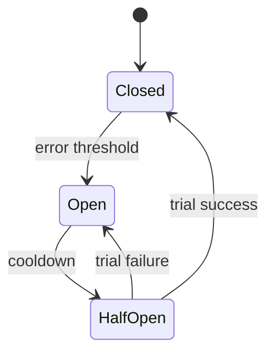

import { ConceptTemplate } from '@/features/kb/components/templates/ConceptTemplate'
import { Callout } from '@/features/kb/components/mdx/Callout'
import { ComparisonTable } from '@/features/kb/components/mdx/ComparisonTable'

export default function Layout({ children }) {
  return (
    <ConceptTemplate title="Circuit Breakers">
      {children}
    </ConceptTemplate>
  )
}

A **circuit breaker** watches calls to a dependency. When errors or timeouts cross a threshold, it **opens** and fails fast without touching the network. After a cooldown it **half-opens**, lets a trial call through, and either **closes** (healthy) or opens again. The metaphor is an electrical breaker: stop feeding a short.

## 1. Deep Dive and Mechanics

Closed is the normal path. Each failure increments a windowed count or error ratio. Open returns a fallback or error immediately. Half-open is the dangerous state: too many trial calls can re-flood a recovering service; too few and you stay open too long.

**What should trip.** Timeouts, connection refusals, and 5xx. Usually not 4xx from bad input — that is your bug, not their outage. Do not trip on every slow call if slowness is the SLO; use a separate latency breaker if needed.

**Reset.** Time-based (open for 30 s) or on a health signal. Prefer jittered cooldown so every instance does not half-open in lockstep.

<Callout icon="warning" title="A fallback that hits the same dependency is not a fallback">
Serving a cached value, a default, or a degraded message is a fallback. Retrying the same host immediately is just hope.
</Callout>

## 2. Mathematical / Theoretical Foundation

A breaker is a finite-state machine with hysteresis. Thresholds exist so brief blips do not flap. Error ratio in a sliding window of N calls is a binomial estimate; small N is noisy, so require a minimum sample.

Independence assumption fails when all instances share the same breaker config and the same clock: synchronized half-open is a thundering herd. Jitter breaks the synchrony.

<ComparisonTable
  headers={['State', 'Calls dep', 'User sees', 'Exit when']}
  rows={[
    ['Closed', 'Yes', 'Real result or error', 'Error ratio over limit'],
    ['Open', 'No', 'Fast fail or fallback', 'Cooldown elapses'],
    ['Half-open', 'Limited trial', 'Trial or fail', 'Success closes, fail opens'],
  ]}
/>

## 3. Real-World Implementation

```python
import time

class Breaker:
    def __init__(self, trip_after=5, cool_s=30):
        self.trip_after = trip_after
        self.cool_s = cool_s
        self.fails = 0
        self.open_until = 0.0

    def allow(self):
        return time.time() >= self.open_until

    def ok(self):
        self.fails = 0

    def fail(self):
        self.fails += 1
        if self.fails >= self.trip_after:
            self.open_until = time.time() + self.cool_s
```

Production libraries add sliding windows, half-open permits, and metrics. Do not roll a clever one in every service.

## 4. Visualizations



## 5. Interview Prep

**Q: Breaker versus timeout versus retry?**
**A:** Timeout bounds one call. Retry repeats a maybe-transient error. Breaker stops the whole flow after evidence of outage. Retries into an open outage make things worse; the breaker exists to halt that.

**Q: Where do you put it?**
**A:** On the client of the dependency (service mesh or SDK). A server-side breaker cannot save the client's threads.

**Q: What do you return when open?**
**A:** Cached data, a partial page, a queued write, or a clear error. Pick per use case. Silent success is a consistency bug.

## 6. Production Use Cases

- **Checkout calling a fraud API** that can flap; fail closed or queue for async review.
- **Recommendation widgets** that disappear rather than delay the product page.
- **Mesh defaults** (Envoy outlier detection) around every east-west hop.

<Callout icon="tip" title="Alert on open, not only on 5xx">
An open breaker can hide origin errors and look like a calm error rate. Page on breaker_open and fallback_used.
</Callout>
