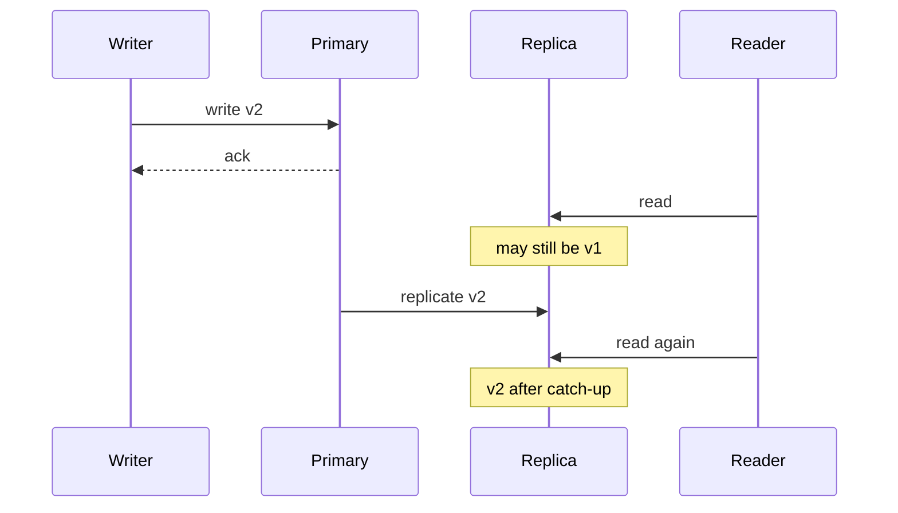

import { ConceptTemplate } from '@/features/kb/components/templates/ConceptTemplate'
import { Callout } from '@/features/kb/components/mdx/Callout'
import { ComparisonTable } from '@/features/kb/components/mdx/ComparisonTable'

export default function Layout({ children }) {
  return (
    <ConceptTemplate title="Consistency">
      {children}
    </ConceptTemplate>
  )
}

**Consistency** answers whether two observers can disagree about the latest value. It is not the C in the old ACID slogan alone, and it is not "the data looks tidy." In distributed systems it is a contract: after a write returns, which reads must see it, and in what order.

## 1. Deep Dive and Mechanics

**Linearizability** (strong / external consistency) makes the system behave as if there is one copy and one real-time order. A read that starts after a write returns must see that write or a later one.

**Sequential consistency** preserves each client's order but may reshuffle real-time across clients.

**Causal consistency** preserves cause-and-effect (you see your writes and the writes you observed) but allows concurrent branches.

**Eventual consistency** says that if writes stop, replicas converge. It says little about any given read.

<Callout icon="info" title="Pick the guarantee per object">
User password hashes want linearizability. View counters can be eventual. One global default is how teams ship bugs.
</Callout>

## 2. Mathematical / Theoretical Foundation

CAP and PACELC constrain what you can promise during a partition and during normal operation. Formal models (Herlihy and Wing linearizability, session guarantees of Terry et al.) define legal histories: sequences of request/response events that could have come from a single-copy spec.

Read-your-writes, monotonic reads, and monotonic writes are session properties you can add on top of a weaker store with sticky routing or version tokens.

<ComparisonTable
  headers={['Model', 'Real-time order', 'Stale read after write', 'Typical store']}
  rows={[
    ['Linearizable', 'Yes', 'No', 'etcd, Spanner reads'],
    ['Serializable SI', 'Per transaction', 'Inside rules', 'Postgres, Cockroach'],
    ['Causal', 'Causal only', 'Possible if concurrent', 'Some CRDT / Cosmos modes'],
    ['Eventual', 'No', 'Yes until catch-up', 'DNS, Dynamo-style'],
  ]}
/>

## 3. Real-World Implementation

```python
# Sticky session: read-your-writes without a linearizable store
def put_profile(cache, db, user_id, body, versions):
    ver = db.upsert(user_id, body)
    versions[user_id] = ver
    cache.set(user_id, body, ver)

def get_profile(cache, db, user_id, versions):
    cached = cache.get(user_id)
    min_ver = versions.get(user_id, 0)
    if cached and cached.ver >= min_ver:
        return cached.body
    return db.fetch(user_id)  # fall back until replica or cache catches up
```

Tokens can live in a cookie or in Redis keyed by session. Do not pretend this is linearizability across devices.

## 4. Visualizations



## 5. Interview Prep

**Q: Is ACID consistency the same as CAP consistency?**
**A:** No. ACID C is about constraints and a valid state after a transaction. CAP C is linearizability of a replicated object. Do not mix them in an interview answer.

**Q: How do you explain consistency to a product manager?**
**A:** "After I save, how long can another screen show the old value, and can two cashiers sell the last seat?" That maps to SLA plus conflict rules.

**Q: Can you buy strong consistency with a cache?**
**A:** Only if the cache is on the linearizable path or is invalidated synchronously. A TTL cache is an eventual layer by construction.

## 6. Production Use Cases

- **Ledger and inventory** with serializable or linearizable writes.
- **Social feeds** with eventual likes and causal comment threads.
- **Feature flags** with session-sticky reads so a user does not flap mid-request.

<Callout icon="tip" title="Write the anomaly you accept">
"Eventual" is incomplete. Say "stale up to 5 s on this key class" or "lost update possible on concurrent edits."
</Callout>
