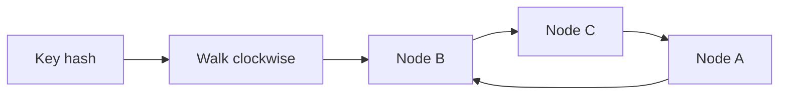

import { ConceptTemplate } from '@/features/kb/components/templates/ConceptTemplate'
import { Callout } from '@/features/kb/components/mdx/Callout'
import { ComparisonTable } from '@/features/kb/components/mdx/ComparisonTable'

export default function Layout({ children }) {
  return (
    <ConceptTemplate title="Consistent Hashing">
      {children}
    </ConceptTemplate>
  )
}

**Consistent hashing** places keys and nodes on a ring so that when membership changes, only keys that lived near the changed node move. Classic modulo hashing — hash(key) mod N — remaps nearly every key when N changes. That is a cache stampede and a data-migration disaster.

## 1. Deep Dive and Mechanics

Hash nodes onto a circular identifier space. Hash the key onto the same circle. Walk clockwise to the first node. That node owns the key. Remove a node and its keys fall to the next clockwise neighbor. Add a node and it steals a slice from its successor.

**Virtual nodes (vnodes).** One physical server appears as many points on the ring. That smooths load when hash points would otherwise clump, and it lets a fat machine advertise more vnodes than a small one.

**Replication.** Store copies on the next R-1 successors so a death still has data on the ring. Repair and hinted handoff fill the holes.

<Callout icon="info" title="The ring is a coordination problem">
Everyone must agree on membership and vnode weights. Gossip, a config service, or a control plane publishes the map. A split view of the ring is a consistency bug.
</Callout>

## 2. Mathematical / Theoretical Foundation

On a uniform ring, expected fraction of keys owned by a node is about 1/N. Expected remapped fraction when one node of N is added or removed is about 1/N. Virtual nodes reduce variance of share (order 1/sqrt(v) style concentration).

Rendezvous hashing (HRW) is a cousin: score each node with hash(key, node) and pick the max. It also remaps ~1/N and needs no explicit ring walk.

<ComparisonTable
  headers={['Scheme', 'On N to N+1', 'Hotspot control', 'Common home']}
  rows={[
    ['hash mod N', 'Almost all keys', 'Poor if N small', 'Toy examples'],
    ['Consistent hash ring', 'About 1/N', 'Vnodes', 'Dynamo, caches'],
    ['HRW / rendezvous', 'About 1/N', 'Weighted scores', 'Some CDNs, caches'],
    ['Range shards', 'Split one range', 'Manual or auto split', 'Bigtable, Vitess'],
  ]}
/>

## 3. Real-World Implementation

```python
import hashlib
import bisect

def h(s):
    return int(hashlib.sha1(s.encode()).hexdigest(), 16)

class Ring:
    def __init__(self, nodes, vnodes=50):
        self.points = []
        self.map = {}
        for n in nodes:
            for i in range(vnodes):
                p = h(n + '#' + str(i))
                self.points.append(p)
                self.map[p] = n
        self.points.sort()

    def owner(self, key):
        p = h(key)
        i = bisect.bisect_left(self.points, p) % len(self.points)
        return self.map[self.points[i]]
```

## 4. Visualizations



## 5. Interview Prep

**Q: Why did modulo hashing fail the cache fleet?**
**A:** Changing N reshuffles almost every key. Hit rate collapses and the database absorbs a stampede. Consistent hashing moves only the slice of the lost or added node.

**Q: How do you rebalance a hot key?**
**A:** Vnodes do not split a single popular key. You need application sharding of that key, a local replica pool, or a different partition function.

**Q: Ring versus directory-based sharding?**
**A:** A directory (lookup table) can place keys anywhere and migrate one shard at a time. It needs a strongly consistent map. The ring is decentralized and simpler, with less placement freedom.

## 6. Production Use Cases

- **Distributed caches** (Memcached clients, some Redis clusters).
- **Dynamo-style stores** with preference lists on the ring.
- **Request routing** to stateful workers that should see the same session.

<Callout icon="tip" title="Watch load per vnode, not only per host">
A bad hash or a skewed keyspace still piles work on one point. Metrics must be per physical node after vnode aggregation.
</Callout>
