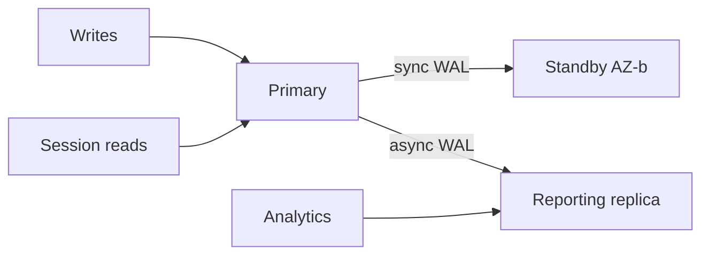

import { ConceptTemplate } from '@/features/kb/components/templates/ConceptTemplate'
import { Callout } from '@/features/kb/components/mdx/Callout'
import { ComparisonTable } from '@/features/kb/components/mdx/ComparisonTable'

export default function Layout({ children }) {
  return (
    <ConceptTemplate title="Database Replication">
      {children}
    </ConceptTemplate>
  )
}

**Database replication** keeps copies of data on more than one node. You do it for high availability (a replica can take over), for read scale (offload SELECTs), and for locality (a replica near a region). The price is lag, conflict, and a failover story you must actually practice.

## 1. Deep Dive and Mechanics

**Single-primary (leader).** All writes go to one node. Secondaries apply a log (WAL, binlog, Oplog). Reads can go to the leader (safe) or to replicas (stale by lag). Failover promotes a replica; you risk losing unflushed or unreplicated writes.

**Multi-primary.** Several nodes accept writes. You need conflict resolution (last-write-wins, CRDTs, or application merge) or a partitioning rule that avoids conflicts.

**Sync versus async.** Synchronous commit waits for N replicas to fsync. That is latency for durability. Asynchronous is fast and can lose the tail of the log on crash.

<Callout icon="warning" title="Replica lag is a product bug if you hide it">
A user writes a profile and immediately reads a replica. They see the old bio and retry forever. Sticky primary reads or a version token fix the session.
</Callout>

## 2. Mathematical / Theoretical Foundation

Durability of a committed write under crash is a function of the ack quorum. If you wait for f replicas of n, you can lose f-1 disks and still have the bytes. CAP shows you cannot stay fully available and linearizable across a partition; replication mode is how you pick the side.

Lag L is roughly apply_rate deficit integrated over time. Backpressure or throttled replicas bound L; infinite queues do not.

<ComparisonTable
  headers={['Mode', 'Write home', 'Failover', 'Conflict']}
  rows={[
    ['Async primary-replica', 'One primary', 'May lose tail', 'None on writes'],
    ['Quorum sync', 'Primary plus acks', 'Safer promote', 'None on writes'],
    ['Multi-primary', 'Many', 'Per region', 'Must resolve'],
    ['Logical CDC', 'Primary log', 'Downstream only', 'Pipeline lag'],
  ]}
/>

## 3. Real-World Implementation

```
# PostgreSQL idea: sync replica for durability, async for reporting
synchronous_standby_names = 'FIRST 1 (standby_az_b)'
# app: writes and read-your-writes to primary
# analytics: prefer replica, accept lag
```

Monitor replay_lag and pause promotion if the candidate is hours behind. Test failover on a cadence, not only in an outage.

## 4. Visualizations



## 5. Interview Prep

**Q: Does replication replace backups?**
**A:** No. Replicas happily replicate a DROP TABLE. Backups and PITR are a different failure mode (human and logical error).

**Q: How do you scale reads?**
**A:** Replicas help until writes or apply lag dominate. Then you shard. Also, not every read can tolerate replica lag.

**Q: What is split-brain?**
**A:** Two primaries accepting writes after a bad failover. You get divergent rows that no automatic replica can merge safely. Fencing and leases exist to prevent it.

## 6. Production Use Cases

- **OLTP HA** with a sync standby in another AZ.
- **Read replicas** for heavy reporting off the primary.
- **Cross-region async** for disaster recovery with a documented RPO.

<Callout icon="tip" title="State RPO in seconds, not in adjectives">
    "We replicate" is not an RPO. "Async, typical lag 2 s, worst 60 s on saturation" is a design.
</Callout>
