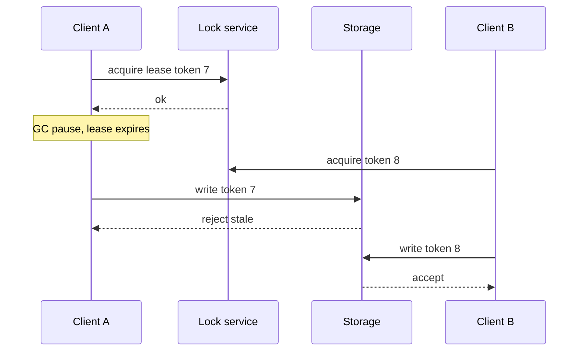

import { ConceptTemplate } from '@/features/kb/components/templates/ConceptTemplate'
import { Callout } from '@/features/kb/components/mdx/Callout'
import { ComparisonTable } from '@/features/kb/components/mdx/ComparisonTable'

export default function Layout({ children }) {
  return (
    <ConceptTemplate title="Distributed Locks">
      {children}
    </ConceptTemplate>
  )
}

A **distributed lock** is a mutex that works across machines. You use it so only one cron runs a nightly job, only one writer rebuilds an index, or only one leader mutates a shard. A lock that is "usually exclusive" is worse than no lock: two holders will corrupt state on the rare network blip.

## 1. Deep Dive and Mechanics

The primitive is a **lease**, not a forever lock. Client A acquires key K with a TTL and a unique token. It heartbeats to extend. If A dies, the TTL expires and B may acquire. If A was paused by a GC storm and wakes after expiry, A is a **zombie holder** and must be fenced.

**Fencing tokens.** Each acquire returns a monotonic token (version). Storage rejects writes with a stale token. Without fencing, the zombie writes after the new owner has started.

**What not to use.** A single Redis SET NX without fencing for money movement. A DB row lock that you hold across a network call. ZooKeeper / etcd / Consul ephemeral nodes are closer to a correct design if you treat session loss as loss of the lock.

<Callout icon="error" title="Pause is indistinguishable from death">
A lock service that expires you cannot tell GC from crash. Always assume you may run the critical section after losing the lock, and make that safe with tokens or idempotency.
</Callout>

## 2. Mathematical / Theoretical Foundation

Safety is mutual exclusion: at most one **valid** holder at a time. Liveness is that some acquirer eventually succeeds if holders fail. TTL-based locks sacrifice safety under long pauses unless the resource is fenced.

Martin Kleppmann's critique of Redlock is about this timing assumption: if the lock service and the clients do not share a correct timing model, SET NX is not a safety proof.

<ComparisonTable
  headers={['Tool', 'Lease', 'Fence token', 'Fit']}
  rows={[
    ['DB unique row / txn', 'Txn lifetime', 'Txn itself', 'Short sections, same DB'],
    ['etcd / ZooKeeper', 'Session', 'Revision / zxid', 'Leaders, jobs'],
    ['Redis SET NX PX', 'TTL', 'You must add', 'Best-effort, not ledgers'],
    ['Chubby / locksmith', 'Lease', 'Yes', 'Control planes'],
  ]}
/>

## 3. Real-World Implementation

```python
# Fence: storage refuses stale tokens
def write_shard(store, shard, token, payload):
    current = store.token(shard)
    if token < current:
        raise RuntimeError('stale_fence_token')
    store.put(shard, payload, token)
```

Acquire the lock, read the token, pass the token into every write. Do not do 30 seconds of CPU while holding a 10-second lease.

## 4. Visualizations



## 5. Interview Prep

**Q: Is Redis a good distributed lock?**
**A:** For dropping duplicate cache fills, often yes. For a bank transfer, no, unless you add fencing and accept Redis as not a consensus system in the Redlock sense. Prefer the database transaction or etcd.

**Q: Lock versus leader election?**
**A:** Election is a long-lived lock on the "leader" role plus a watch so followers notice loss. Same lease and fence problems.

**Q: How long should the TTL be?**
**A:** Longer than one safe heartbeat plus jitter, shorter than the outage you can tolerate with no owner. Heartbeat at a fraction of TTL.

## 6. Production Use Cases

- **Scheduled jobs** so k8s cron replicas do not all send the same email blast.
- **Shard primary** in a home-grown datastore.
- **Idempotent migrations** that must not run twice on overlapping deploys.

<Callout icon="tip" title="Prefer idempotency over a long critical section">
If the work can safely run twice, you may not need a lock. If it cannot, fence every write.
</Callout>
