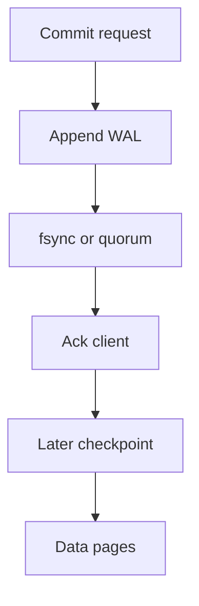

import { ConceptTemplate } from '@/features/kb/components/templates/ConceptTemplate'
import { Callout } from '@/features/kb/components/mdx/Callout'
import { ComparisonTable } from '@/features/kb/components/mdx/ComparisonTable'

export default function Layout({ children }) {
  return (
    <ConceptTemplate title="Durability">
      {children}
    </ConceptTemplate>
  )
}

**Durability** is the D in ACID: after the system says "committed," the write must survive the failures you listed in the contract. RAM is not durable. A single SSD is not durable against fire. A replica in the same rack is not durable against the rack.

## 1. Deep Dive and Mechanics

Writes become durable through a **log**. The database appends to a WAL, fsyncs (or equivalent), then later checkpoints pages. If you skip fsync, you trade durability for latency and can lose the last few milliseconds or seconds of "committed" work on power loss.

**Replication is a second disk.** Quorum commit waits until enough nodes have the log bytes. Async replication is a durability maybe.

**Backups are a third axis.** They protect against logical deletes and bad deploys that replication will cheerfully copy. Point-in-time recovery needs the WAL after the snapshot.

<Callout icon="warning" title="Committed is a defined word">
If the driver timed out, you do not know if the commit landed. Design the write to be idempotent and check server-side state.
</Callout>

## 2. Mathematical / Theoretical Foundation

Independent failure of disks with annual failure rate p gives survival (1 - p)^n for n copies if failures are independent. They are not: same firmware, same SAN, same AZ flood. Durability math without correlated-failure design is fiction.

fsync latency is a physical lower bound on sync commit. Group commit batches many transactions into one fsync to amortize.

<ComparisonTable
  headers={['Ack when', 'Lost on crash', 'Lost on AZ fire', 'Typical']}
  rows={[
    ['Memory only', 'Yes', 'Yes', 'Cache, Redis default caveats'],
    ['Local fsync', 'Unlikely', 'Yes', 'Single-node Postgres'],
    ['Quorum of AZs', 'Unlikely', 'Unlikely if spread', 'Multi-AZ DBs'],
    ['Object store + PITR', 'Depends on RPO', 'Recoverable', 'Backups'],
  ]}
/>

## 3. Real-World Implementation

```
# PostgreSQL: do not turn these off because a blog said it was faster
fsync = on
synchronous_commit = on
full_page_writes = on
wal_level = replica
```

For a cache of derived HTML, asynchronous is fine. For a payment capture, wait for the durability you sold the auditor.

## 4. Visualizations



## 5. Interview Prep

**Q: Is replication durability?**
**A:** Only for the failures it covers. Three replicas in one AZ die together. Durability is a list of tolerated failures, not a replica count.

**Q: Why is fsync expensive?**
**A:** It waits for the device to put bits in non-volatile media. Group commit and a battery-backed controller hide some of that cost.

**Q: Durability versus availability?**
**A:** Sync quorum can refuse writes if too many replicas are down (you kept durability, lost availability). Async keeps taking writes you might lose.

## 6. Production Use Cases

- **Payment ledgers** with sync commit and off-site PITR.
- **Queue acknowledgements** only after the consumer's side effect is durable.
- **Object storage** with cross-region replication for blobs that cannot be regenerated.

<Callout icon="tip" title="Write the failure list on the design doc">
Process crash, disk loss, AZ loss, region loss, bad DROP. Each needs a different control.
</Callout>
