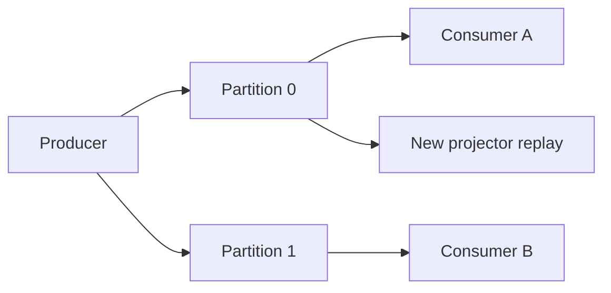

import { ConceptTemplate } from '@/features/kb/components/templates/ConceptTemplate'
import { Callout } from '@/features/kb/components/mdx/Callout'
import { ComparisonTable } from '@/features/kb/components/mdx/ComparisonTable'

export default function Layout({ children }) {
  return (
    <ConceptTemplate title="Event Streaming">
      {children}
    </ConceptTemplate>
  )
}

**Event streaming** treats the log as the system of record for "things that happened." Producers append events. Consumers read at their own offset. Unlike a queue that deletes a message after one worker acks, a stream retains history so new consumers can replay.

## 1. Deep Dive and Mechanics

A stream is partitioned for scale. Each partition is an ordered append-only log. A key (user id, order id) hashes to a partition so that events for that key stay ordered. Consumers in a group split partitions among themselves.

**Retention.** Time, size, or compact-by-key (keep the latest value per key, as in a changelog). Compaction turns the stream into a replicated state snapshot plus tail.

**Delivery.** At-least-once is the honest default: a crash before offset commit replays. Exactly-once is an end-to-end protocol (idempotent produce + transactional consume) and is still easy to break in your side effects.

<Callout icon="info" title="The log is not a database by itself">
You still need projections for queries you cannot answer by scanning a week of events on the request path.
</Callout>

## 2. Mathematical / Theoretical Foundation

A partition is a total order. The stream as a whole is a partial order: events in different partitions have no defined sequence unless you add timestamps or a join. Throughput scales with partition count until you hit per-partition hot keys.

Offset o is a cursor. Consumer lag is high_watermark minus committed offset. Stability requires consume rate at or above produce rate on each partition, or lag grows without bound.

<ComparisonTable
  headers={['Style', 'Retention', 'Consumer model', 'Example']}
  rows={[
    ['Queue', 'Until ack', 'Competing consumers', 'SQS classic'],
    ['Stream / log', 'Hours to forever', 'Replay by offset', 'Kafka, Kinesis'],
    ['Pub-sub push', 'Short buffer', 'All subscribers', 'SNS, some MQTT'],
    ['CDC stream', 'Log of DB writes', 'Projectors', 'Debezium'],
  ]}
/>

## 3. Real-World Implementation

```python
# Conceptual consumer loop: process then commit
def run(consumer, handler):
    while True:
        rec = consumer.poll()
        if rec is None:
            continue
        handler(rec.value)
        consumer.commit(rec.offset)
```

If handler is not idempotent, a crash between handler and commit duplicates the side effect. Put a unique event id in a processed table, or use transactional outbox plus store transactions.

## 4. Visualizations



## 5. Interview Prep

**Q: Stream versus queue?**
**A:** A queue is a buffer of work to do once. A stream is a history many readers can share and replay. Use a queue for "send this email." Use a stream for "order lifecycle that billing, fraud, and search all need."

**Q: How do you guarantee order?**
**A:** Per key, by putting that key on one partition and consuming it with one worker at a time. Global order does not scale.

**Q: What is a compacted topic for?**
**A:** Latest state per key (user profile, ktable). New consumers bootstrap from compacted snapshots instead of the entire history.

## 6. Production Use Cases

- **Order and payment events** feeding search, email, and analytics.
- **CDC** from OLTP into a warehouse or search index.
- **Activity logs** for ML features and audit.

<Callout icon="tip" title="Put a schema and an event id on every record">
Unversioned JSON and missing ids make replay and exactly-once a folklore project.
</Callout>
