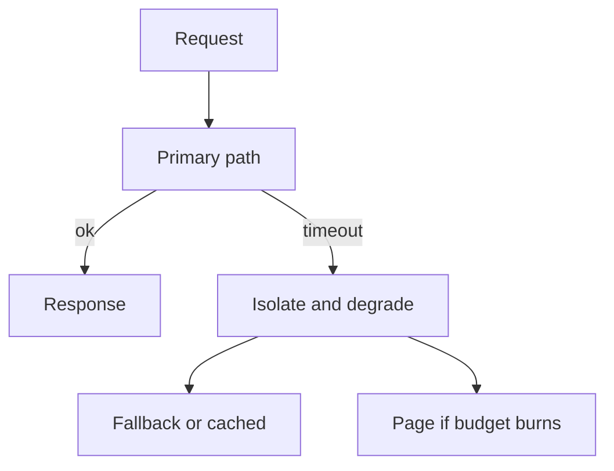

import { ConceptTemplate } from '@/features/kb/components/templates/ConceptTemplate'
import { Callout } from '@/features/kb/components/mdx/Callout'
import { ComparisonTable } from '@/features/kb/components/mdx/ComparisonTable'

export default function Layout({ children }) {
  return (
    <ConceptTemplate title="Fault Tolerance">
      {children}
    </ConceptTemplate>
  )
}

**Fault tolerance** is the ability to continue correct operation when parts fail. Failures are normal: disks die, GC pauses look like death, operators ship bad config. Tolerance is redundancy plus a recovery story, not optimism.

## 1. Deep Dive and Mechanics

Classify faults. **Crash-stop:** a node disappears. **Crash-recovery:** it returns with or without disk. **Omission:** messages drop. **Byzantine:** a node lies. Most business systems assume crash and omission, not Byzantine, except in multi-party or hostile settings.

**Patterns.** Replicas and quorum. Timeouts and retries with jitter. Bulkheads. Graceful degradation. Chaos tests that pull the plug on a dependency. Health checks that fail the instance out of the balancer.

**Correctness still matters.** Serving leftover cached prices during an outage may be available and still wrong. Define the degraded mode explicitly.

<Callout icon="info" title="MTTR often beats another nine of MTTF">
Detecting and failing over in 30 seconds can beat heroic hardware that still needs an hour of human repair.
</Callout>

## 2. Mathematical / Theoretical Foundation

Reliability of a series system multiplies. Parallel redundancy with independent failures: unavailability is the product of unavailabilities. The independence assumption is the weak spot (shared power, shared config repo).

The FLP result says deterministic consensus is impossible in a fully async crash-stop model. Practical systems add timeouts (partial synchrony) to elect and make progress.

<ComparisonTable
  headers={['Fault', 'User symptom', 'Control', 'Limit']}
  rows={[
    ['Crash-stop node', 'Fewer replicas', 'LB + restart', 'Need spare capacity'],
    ['Slow node', 'Tail latency', 'Timeouts, shedding', 'Hard to distinguish'],
    ['Bad deploy', 'Error spike', 'Canary, rollback', 'Shared binary'],
    ['Byzantine', 'Wrong answers', 'Quorum of honest', 'Costly'],
  ]}
/>

## 3. Real-World Implementation

```python
def with_fallback(primary, secondary, timeout_s):
    try:
        return primary(timeout_s)
    except TimeoutError:
        return secondary(timeout_s)
```

Fallback must not share the same failure domain as primary (same host, same DB primary). Measure how often you take the branch.

## 4. Visualizations



## 5. Interview Prep

**Q: Fault tolerance versus high availability?**
**A:** HA is a user-visible uptime goal. Fault tolerance is the mechanism (redundancy, isolation) that makes HA possible. You can be fault tolerant for crashes and still miss an SLO due to overload.

**Q: How many replicas?**
**A:** Two survive one crash if failover works. Three is the usual consensus minimum so a majority remains. More than that is geography and read scale, not magic.

**Q: What do you test?**
**A:** Kill a node, a AZ, a dependency, and the clock. If you never pull the plug, you have a document, not a property.

## 6. Production Use Cases

- **Stateless app tiers** with N+1 instances and rolling deploys.
- **Quorum stores** for config and locks.
- **Degraded search** that returns a smaller, stale index rather than a 500.

<Callout icon="tip" title="Write the degraded mode in the runbook">
If the payments client is down, do we queue, fail the cart, or take orders in review? Decide before the page.
</Callout>
