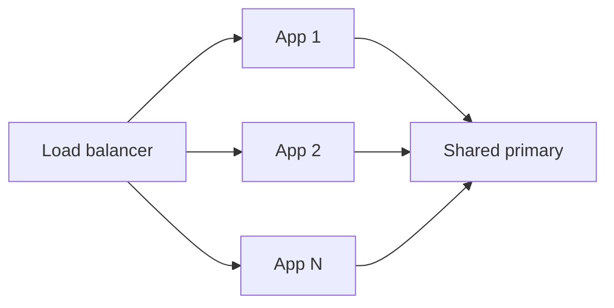

import { ConceptTemplate } from '@/features/kb/components/templates/ConceptTemplate'
import { Callout } from '@/features/kb/components/mdx/Callout'
import { ComparisonTable } from '@/features/kb/components/mdx/ComparisonTable'

export default function Layout({ children }) {
  return (
    <ConceptTemplate title="Horizontal Scaling">
      {children}
    </ConceptTemplate>
  )
}

**Horizontal scaling** (scale out) adds more machines. A load balancer spreads work. Stateless app servers scale out almost linearly until a shared dependency (the database) saturates. Stateful systems scale out only after you partition data and accept the operational cost.

## 1. Deep Dive and Mechanics

**Stateless workers.** Put sessions in Redis or JWTs, keep the app disk empty, and add pods. This is the default web pattern.

**Stateful scale-out.** Shard by key. Each node owns a slice. You now own rebalancing, hot keys, cross-shard queries, and distributed transactions. That is a different product.

**What does not scale out for free.** A single-primary database, a global lock, a chatty chatty N-squared service mesh, and a giant in-memory set that must be fully replicated to every node.

<Callout icon="info" title="You are scaling the bottleneck">
Adding app pods when the primary CPU is at 95 percent makes the outage louder. Profile the constraint first.
</Callout>

## 2. Mathematical / Theoretical Foundation

Ideal speedup is linear: capacity ~ N. Amdahl's law: if a fraction s of the work is serial (one primary, one lock), speedup is bounded by 1/s. Universal scaling law adds coherency cost that grows with N (cross-talk).

Rebalance cost when adding a node is the data you must move. Consistent hashing aims for about 1/N moved; range splits move one shard.

<ComparisonTable
  headers={['Tier', 'Scale-out ease', 'Shared choke', 'Next step']}
  rows={[
    ['Stateless HTTP', 'Easy', 'DB or cache', 'Add pods'],
    ['Cache cluster', 'Moderate', 'Hot keys', 'Vnodes, split keys'],
    ['SQL primary', 'Hard', 'The primary', 'Replicas then shards'],
    ['Queue consumers', 'Easy', 'Poison messages', 'Add workers'],
  ]}
/>

## 3. Real-World Implementation

```yaml
# k8s: scale the deployment, not the single-primary DB
apiVersion: apps/v1
kind: Deployment
metadata:
  name: checkout-api
spec:
  replicas: 12
  template:
    spec:
      containers:
        - name: app
          resources:
            limits:
              cpu: '1'
              memory: 512Mi
```

Autoscale on concurrency or lag, not only CPU. A blocked thread pool can be at low CPU and still need more pods — or need a bigger pool, not more pods.

## 4. Visualizations



## 5. Interview Prep

**Q: Horizontal versus vertical?**
**A:** Vertical buys a bigger box (simple, ceiling, blast radius). Horizontal buys more boxes (elastic, needs statelessness or shards). Most mature systems do both: fat enough nodes, then many of them.

**Q: When does scale-out make latency worse?**
**A:** When each request fans out to more nodes (scatter-gather) or when coordination (locks, 2PC) grows with N.

**Q: How do you know it worked?**
**A:** Plot capacity (QPS at SLO) versus N. If the curve bends over, you found the serial part.

## 6. Production Use Cases

- **Web and API fleets** behind an LB or service mesh.
- **Consumer groups** on Kafka partitions.
- **Sharded KV or search** clusters with planned rebalance windows.

<Callout icon="tip" title="Keep one extra replica of capacity">
N+1 (or N+2) is how you deploy and survive a node loss without riding 100 percent.
</Callout>
