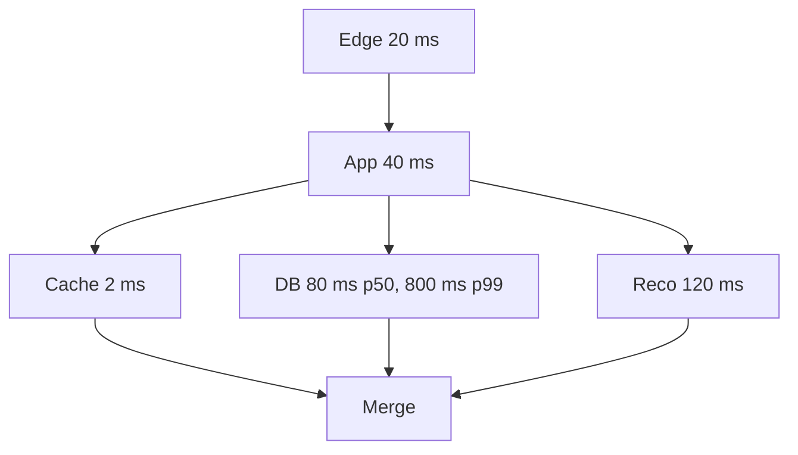

import { ConceptTemplate } from '@/features/kb/components/templates/ConceptTemplate'
import { Callout } from '@/features/kb/components/mdx/Callout'
import { ComparisonTable } from '@/features/kb/components/mdx/ComparisonTable'

export default function Layout({ children }) {
  return (
    <ConceptTemplate title="Latency">
      {children}
    </ConceptTemplate>
  )
}

**Latency** is how long one unit of work takes to finish. Users feel p50 a little and p99 a lot. Averages hide the queue. System design is mostly a fight with tails: GC, disk, lock waits, and a slow dependency on the critical path.

## 1. Deep Dive and Mechanics

Latency adds along a **critical path**. Parallel fan-out is max, not sum, plus merge cost. Sequential hops add. A "microservice refactor" that turns one DB query into eight RPCs often loses even if each RPC is fast.

**Queues.** When utilization rises, wait time explodes (M/M/1 wait ~ rho / (1-rho)). Running hot is how you buy a latency incident.

**Budgets.** Give the page 800 ms. Spend it: 50 ms edge, 100 ms app, 200 ms DB, rest for JS. Any new hop must steal from someone.

<Callout icon="warning" title="p99 is a different system than p50">
The median may be a cache hit. The tail is a miss, a retry, a slow disk, and a cold JVM. Optimize the tail on purpose.
</Callout>

## 2. Mathematical / Theoretical Foundation

Little's law: concurrency L = lambda * W. If you want W low, you cannot run huge L without huge lambda. Tail bounds (Chebyshev, or empirical histograms) beat a single mean.

Retry amplification: a 1 percent timeout with two retries can triple load on an already slow dep, which raises latency further (retry storm).

<ComparisonTable
  headers={['Metric', 'What it hides', 'Use for']}
  rows={[
    ['Average', 'Tails and multi-modes', 'Never as an SLO'],
    ['p50', 'The unhappy 50 percent', 'Happy-path debug'],
    ['p95 / p99', 'The last 1 percent', 'User SLOs'],
    ['p99.9 / max', 'Cost of extremes', 'Hard real-time, or debug'],
  ]}
/>

## 3. Real-World Implementation

```python
import time

def timed(fn):
    t0 = time.perf_counter()
    try:
        return fn()
    finally:
        ms = (time.perf_counter() - t0) * 1000
        # histogram.observe(ms)  — never just a running mean
        _ = ms
```

Export a histogram (Prometheus native, or HDR). Alert on SLO burn, not on a 5-minute average crossing 200 ms after users already left.

## 4. Visualizations



## 5. Interview Prep

**Q: How do you cut latency in a design interview?**
**A:** Remove hops, cache the hot read, precompute, move work off the request path, and stop synchronizing on a lock. Then talk about p99, not a happy diagram.

**Q: Why is the p99 10x the p50?**
**A:** Multimodal paths (hit versus miss), GC, noisy neighbors, and queueing. Fix the slow mode; do not micro-optimize the fast one.

**Q: Latency versus bandwidth?**
**A:** Bandwidth is bytes per second. A fat pipe can still have 80 ms RTT. Streaming and windowing help throughput; they do not shrink speed-of-light.

## 6. Production Use Cases

- **Search and checkout** with explicit hop budgets.
- **Edge caches** to eat RTT for static and semi-static reads.
- **Async APIs** that return 202 when the work cannot meet a sync SLO.

<Callout icon="tip" title="Trace the critical path">
A waterfall trace (OpenTelemetry) shows which span stole the budget. Guessing is how you add another cache and miss the lock.
</Callout>
