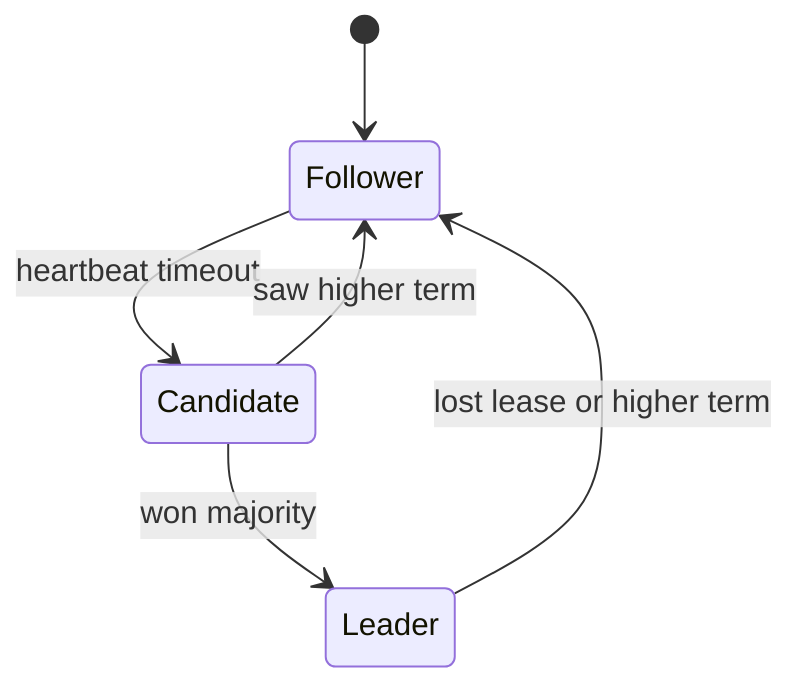

import { ConceptTemplate } from '@/features/kb/components/templates/ConceptTemplate'
import { Callout } from '@/features/kb/components/mdx/Callout'
import { ComparisonTable } from '@/features/kb/components/mdx/ComparisonTable'

export default function Layout({ children }) {
  return (
    <ConceptTemplate title="Leader Election">
      {children}
    </ConceptTemplate>
  )
}

**Leader election** picks one node as the coordinator for a shard or cluster. Followers replicate and serve reads if you allow them. When the leader fails, survivors elect a new one. The hard part is not winning; it is making sure the old leader stays fenced.

## 1. Deep Dive and Mechanics

Algorithms (Raft, Zab, etcd elections) use **terms** or **epochs**. A candidate that gathers a majority becomes leader for that term. Majority means two elections cannot both succeed in the same term.

**Heartbeats.** The leader proves it is alive. Followers start an election if the heartbeat lapses. Timeouts need jitter so they do not all campaign at once.

**Fencing.** Every write carries the term. Storage or the replica set rejects stale terms. A leader that paused and woke up must not overwrite the new leader's log.

<Callout icon="error" title="Two leaders is a data-loss event">
Split-brain happens when a minority partition still thinks it is leader and accepts writes. Quorum writes and term checks are the cure, not hope.
</Callout>

## 2. Mathematical / Theoretical Foundation

Safety: at most one leader can commit in a given term, and a committed entry stays committed. Liveness requires partial synchrony (timeouts eventually work). FLP says you cannot guarantee both safety and progress in a fully async model with one crash.

Lease-based election (Chubby-style) is a timed lock on the leader key. Same pause-versus-death problem as distributed locks.

<ComparisonTable
  headers={['Style', 'Safety mechanism', 'Typical', 'Weakness']}
    rows={[
    ['Majority vote (Raft)', 'Term + quorum log', 'etcd, Consul', 'Needs majority alive'],
    ['Lease in a store', 'TTL + fence', 'Job leaders', 'Clock / pause'],
    ['Human primary', 'Runbook', 'Legacy DBs', 'Slow MTTR'],
    ['Static primary', 'Config', 'Tiny clusters', 'No failover'],
  ]}
/>

## 3. Real-World Implementation

```python
# Conceptual: only act while we still hold the elected term
class Leader:
    def __init__(self, store, name):
        self.store = store
        self.name = name

    def step(self):
        term = self.store.current_term()
        if self.store.leader() != self.name:
            return False
        return self.store.heartbeat(self.name, term)
```

If heartbeat fails, stop writing immediately. Do not finish "just this one" batch.

## 4. Visualizations



## 5. Interview Prep

**Q: Why majority, not all nodes?**
**A:** Waiting for all nodes loses liveness on one crash. Majority stays safe (intersection of quorums) and can proceed with a minority down.

**Q: Can you elect without consensus?**
**A:** You can pick a leader with a lock service that itself uses consensus. If the lock is a single Redis without fencing, you can elect two leaders.

**Q: Leader versus leaderless (Dynamo)?**
**A:** Leader simplifies ordering and transactions per shard. Leaderless avoids a failover hiccup and pays in conflict repair.

## 6. Production Use Cases

- **Shard primaries** in MongoDB, Kafka controllers, and home-grown stores.
- **Singleton jobs** (only one reindexer) via etcd campaign.
- **Control planes** that must serialize cluster-wide mutations.

<Callout icon="tip" title="Practice leader kill on a schedule">
Elections that only run in production incidents are untested code paths. Chaos the leader and watch commit latency.
</Callout>
