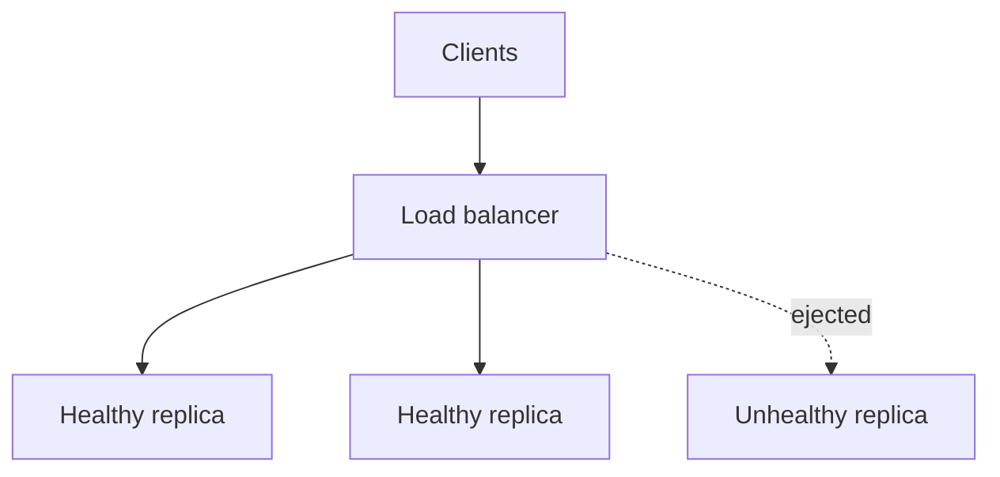

import { ConceptTemplate } from '@/features/kb/components/templates/ConceptTemplate'
import { Callout } from '@/features/kb/components/mdx/Callout'
import { ComparisonTable } from '@/features/kb/components/mdx/ComparisonTable'

export default function Layout({ children }) {
  return (
    <ConceptTemplate title="Load Balancing">
      {children}
    </ConceptTemplate>
  )
}

A **load balancer** sits in front of replicas and chooses where the next connection or request goes. It is how horizontal scaling becomes a single name. Bad balancing creates hot nodes and cold nodes that look like a capacity problem.

## 1. Deep Dive and Mechanics

**L4 versus L7.** L4 (TCP/UDP) maps connections. L7 (HTTP/gRPC) can route on path, host, and header, terminate TLS, and retry idempotent GETs.

**Algorithms.** Round-robin is simple and wrong when requests are heavy-tailed. Least-connections helps. P2C (power of two choices) picks the better of two random healthy nodes and is excellent at scale. Consistent hashing sends the same key to the same node for cache locality.

**Health.** Passive (watch errors) and active (probe). A probe that only hits /health/local will keep a node that cannot reach its DB.

<Callout icon="warning" title="Retries at three layers multiply">
Client retry plus mesh retry plus LB retry can turn one 500 into a self-DDoS. Pick one layer to retry, and cap.
</Callout>

## 2. Mathematical / Theoretical Foundation

The power of two choices: throwing balls into bins, picking the less loaded of two random bins, makes max load grow as log log N instead of log N / log log N. That is why Envoy and many LBs use P2C.

Utilization and latency: a node at 0.9 utilization has long queues. "Even" CPU is not enough if one node got the expensive queries.

<ComparisonTable
  headers={['Algorithm', 'State needed', 'Good at', 'Weak at']}
  rows={[
    ['Round-robin', 'None', 'Equal cheap calls', 'Heavy tails'],
    ['Least-conn', 'Conn counts', 'Long-lived streams', 'Slow to notice CPU'],
    ['P2C', 'Two samples', 'Large fleets', 'Tiny fleets (noise)'],
    ['Consistent hash', 'Key', 'Cache hit rate', 'Hot keys'],
  ]}
/>

## 3. Real-World Implementation

```
# Envoy-style idea: least-request (P2C) + outlier ejection
lb_policy: LEAST_REQUEST
outlier_detection:
  consecutive_5xx: 5
  interval: 10s
  base_ejection_time: 30s
```

Pair with connection limits per backend so one node cannot take the whole herd after a restart (slow-start / warmup).

## 4. Visualizations



## 5. Interview Prep

**Q: Where does the balancer live?**
**A:** Edge (NLB/ALB), service mesh sidecar, or client-side (look up endpoints, pick locally). Client-side removes a hop but pushes health logic into every caller.

**Q: Sticky sessions?**
**A:** They compensate for server memory. They also pin load and complicate failover. Prefer external session stores and stickiness only as a migration crutch.

**Q: How do you avoid thundering a new replica?**
**A:** Slow-start: gradually increase traffic for tens of seconds while JIT, cache, and pools warm.

## 6. Production Use Cases

- **Public HTTPS** via cloud LBs and CDN origins.
- **gRPC east-west** with P2C and outlier detection.
- **Stateful workers** with consistent hashing and virtual nodes.

<Callout icon="tip" title="Balance the expensive unit">
If cost is CPU-seconds, balance on in-flight or EWMA latency, not only connection count.
</Callout>
