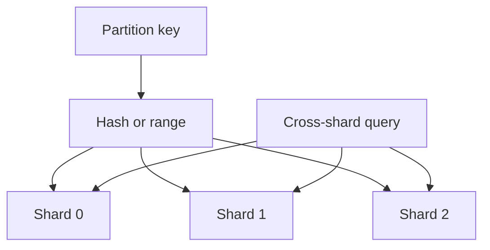

import { ConceptTemplate } from '@/features/kb/components/templates/ConceptTemplate'
import { Callout } from '@/features/kb/components/mdx/Callout'
import { ComparisonTable } from '@/features/kb/components/mdx/ComparisonTable'

export default function Layout({ children }) {
  return (
    <ConceptTemplate title="Partitioning">
      {children}
    </ConceptTemplate>
  )
}

**Partitioning** (sharding when the slices are data) divides a problem so each node owns a subset. Compute partitions are worker pools. Data partitions are key ranges or hashes. The slice key is the most important design choice you will make for a decade.

## 1. Deep Dive and Mechanics

**Hash partitions.** hash(key) maps to a bucket. Even load if the key is even. Range queries across keys become scatter-gather.

**Range partitions.** Keys in [A, M) on node 1, [M, Z) on node 2. Great for scans of a user id prefix. Bad if you shard by timestamp (all writes hit the latest range).

**Directory / lookup.** A table maps key or tenant to a shard. Flexible migrations; the directory must be highly available and consistent.

**Secondary indexes and joins** that span partitions become fan-out queries or are forbidden. Design queries first, then the key.

<Callout icon="warning" title="A hot key is not a partition">
The celebrity user or a popular product id still lands on one shard. You must split the key (bucket suffixes) or cache that row everywhere.
</Callout>

## 2. Mathematical / Theoretical Foundation

Load imbalance: if keys are Zipf, hash partitioning still leaves a heavy tail of hot keys. Expected max load depends on the key distribution, not only on N.

Cross-partition transactions need 2PC or sagas; their latency and abort rate grow with the number of partitions touched. Keep transactions single-partition when you can.

<ComparisonTable
  headers={['Scheme', 'Scan by key prefix', 'Rebalance', 'Hot time-series']}
  rows={[
    ['Hash', 'Poor', 'Ring or vnode move', 'OK if key is not time'],
    ['Range', 'Excellent', 'Split/merge ranges', 'Bad if key is time'],
    ['Directory', 'Depends', 'Move one mapping', 'You can isolate'],
    ['Tenant = shard', 'Per tenant', 'Move a tenant', 'Huge tenant problem'],
  ]}
/>

## 3. Real-World Implementation

```python
def shard_of(user_id, n):
    return hash(user_id) % n

def shard_of_hot(user_id, n, buckets=16):
    # split a hot user across buckets at the cost of fan-out reads
    return hash(user_id + ':b0') % n
```

When one user is hot, store user_id#0 .. user_id#k and query them in parallel. Document that the entity is no longer atomic.

## 4. Visualizations



## 5. Interview Prep

**Q: Partition versus shard versus replica?**
**A:** A partition is a slice of the keyspace. A shard is that slice placed on a node. A replica is a copy of a shard for HA or reads. Do not call three replicas "three shards."

**Q: How do you pick the key?**
**A:** It must be on every request that needs to stay fast, have high cardinality, and keep transactions local. User id, tenant id, or order id are common. Created-at is usually wrong.

**Q: How do you reshard live?**
**A:** Dual-write or migrate by vnode, keep a directory version, and replay. Treat it as a product launch, not a Friday toggle.

## 6. Production Use Cases

- **Multi-tenant SaaS** with tenant id as the shard key.
- **Time-series** sharded by metric id plus time bucket, not by time alone.
- **Search indexes** split by collection or hash of document id.

<Callout icon="tip" title="List the queries before the key">
If the primary read is "all orders last week," a hash of order id will hurt. Start from access patterns.
</Callout>
