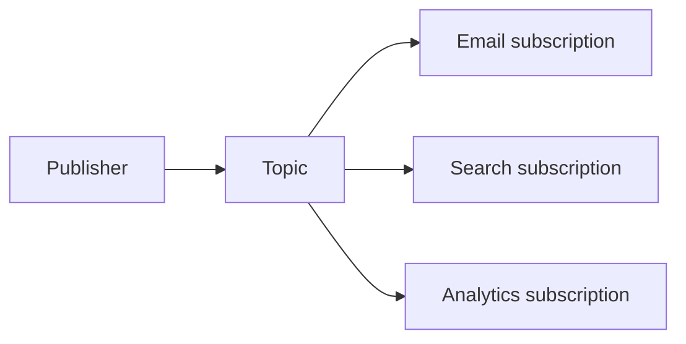

import { ConceptTemplate } from '@/features/kb/components/templates/ConceptTemplate'
import { Callout } from '@/features/kb/components/mdx/Callout'
import { ComparisonTable } from '@/features/kb/components/mdx/ComparisonTable'

export default function Layout({ children }) {
  return (
    <ConceptTemplate title="Pub-Sub">
      {children}
    </ConceptTemplate>
  )
}

**Publish-subscribe** decouples senders from receivers. The publisher writes to a **topic**. The broker fans the message out to each subscription. Publishers do not know how many consumers exist. That is the point — and the operational surprise when a new subscriber triples load.

## 1. Deep Dive and Mechanics

**Fan-out.** Each subscription is its own cursor or queue. A slow subscriber should not block others if the broker isolates storage. In naive in-process observers, one slow listener blocks the publish call.

**Push versus pull.** Push delivers to an HTTP endpoint (SNS, webhooks). Pull lets the subscriber request batches (Pub/Sub pull, Kafka is a log cousin). Pull handles backpressure more naturally.

**Filtering.** Server-side filters reduce traffic. Client-side filters waste bandwidth. Ordering, if any, is usually per key or per partition, not global.

<Callout icon="info" title="Pub-sub is not a job queue">
If exactly one worker should process each item, you want a competing-consumer queue. If every interested system should see the item, you want pub-sub.
</Callout>

## 2. Mathematical / Theoretical Foundation

Cost is O(subscribers) per message in naive fan-out, or O(1) append plus per-subscriber consume in a log design. Retention and replay distinguish "true streams" from fire-and-forget topics that drop when the subscriber is down.

Delivery is typically at-least-once. Dedup is the subscriber's job unless the product offers idempotent keys.

<ComparisonTable
  headers={['Model', 'Who receives', 'Backpressure', 'Example']}
  rows={[
    ['Pub-sub topic', 'All subscribers', 'Per subscription', 'SNS, Pub/Sub'],
    ['Queue', 'One of many workers', 'Queue depth', 'SQS, Rabbit work queues'],
    ['Log stream', 'Each group independently', 'Consumer lag', 'Kafka'],
    ['In-process event', 'In-memory listeners', 'Caller blocks', 'UI buses'],
  ]}
/>

## 3. Real-World Implementation

```python
# Conceptual fan-out: each subscriber gets a copy
def publish(topics, topic, message):
    for sub in topics.get(topic, []):
        sub.enqueue(message)
```

In production, use a broker. Put a schema, a producer id, and an idempotency key on the payload. Make handlers safe to run twice.

## 4. Visualizations



## 5. Interview Prep

**Q: SNS plus SQS?**
**A:** SNS is the fan-out. Each SQS queue is a durable subscription with its own retry and DLQ. That is the classic AWS pattern for "many independent workers."

**Q: Will a subscriber down miss messages?**
**A:** If the topic has no retention and no durable subscription, yes. If the subscription is a queue or a log with retention, it catches up.

**Q: How do you evolve the payload?**
**A:** Additive schema changes, a version field, and a registry. Breaking field reuse is how you poison old consumers.

## 6. Production Use Cases

- **Domain events** (OrderPlaced) to email, loyalty, and fraud.
- **Config or cache invalidation** fan-out (use care; invalidation storms exist).
- **IoT and notifications** with device or user topics.

<Callout icon="tip" title="Give each subscriber its own failure domain">
A shared lambda that does five jobs turns pub-sub back into a monolith with extra steps.
</Callout>
