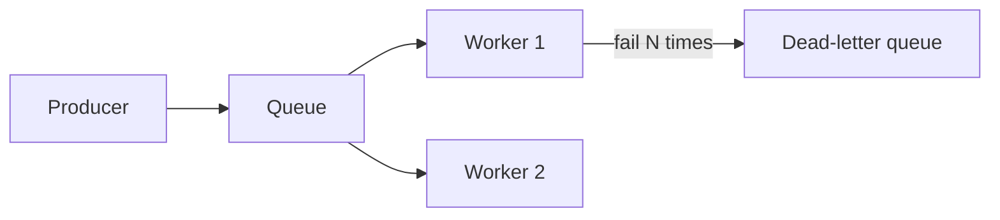

import { ConceptTemplate } from '@/features/kb/components/templates/ConceptTemplate'
import { Callout } from '@/features/kb/components/mdx/Callout'
import { ComparisonTable } from '@/features/kb/components/mdx/ComparisonTable'

export default function Layout({ children }) {
  return (
    <ConceptTemplate title="Queues">
      {children}
    </ConceptTemplate>
  )
}

A **queue** holds work until a consumer can do it. Producers enqueue and return. Consumers pull, process, and ack. Queues absorb spikes, isolate failures, and let you retry. They also hide a growing pile of undone work if nobody watches depth and age.

## 1. Deep Dive and Mechanics

**Competing consumers.** Several workers pull from one queue. Each message should be processed by one worker (at-least-once in practice). Visibility timeouts hide a message while it is in flight; if the worker dies, it reappears.

**Dead-letter queues.** After N failures, park the message. Poison pills must not block the queue forever.

**Ordering.** FIFO queues order per group at a throughput cost. Standard queues are cheaper and can reorder. If order matters, design the key and accept the cap, or make handlers commutative.

<Callout icon="warning" title="Ack after the side effect is durable">
Ack-then-write loses work on crash. Write-then-ack can duplicate. Prefer write-then-ack plus idempotency keys.
</Callout>

## 2. Mathematical / Theoretical Foundation

A queue is a G/G/c system. Stability: arrival rate less than service rate times workers. Depth D ~ (lambda - mu_eff) * t during a spike. Age of the head is the user-visible delay.

Little's law again: in-flight = rate * time-in-system. Visibility timeout must exceed p99 processing or you will double-deliver healthy work.

<ComparisonTable
  headers={['Queue type', 'Order', 'At-least-once', 'Typical cap']}
  rows={[
    ['Standard / best effort', 'No', 'Yes', 'Very high'],
    ['FIFO / group', 'Per group', 'Yes', 'Lower throughput'],
    ['Delay / scheduled', 'No', 'Yes', 'Deferred jobs'],
    ['In-memory channel', 'Yes local', 'No if process dies', 'Tiny'],
  ]}
/>

## 3. Real-World Implementation

```python
def worker(q, db):
    msg = q.receive(visibility_s=30)
    if db.already_done(msg.id):
        q.ack(msg)
        return
    db.apply(msg)  # durable side effect
    q.ack(msg)
```

If apply is not idempotent, store msg.id in a unique table in the same transaction as the side effect.

## 4. Visualizations



## 5. Interview Prep

**Q: Queue versus RPC?**
**A:** RPC is for when the caller needs the answer now. A queue is for when the work can finish later and should survive caller death. Timeouts and user polling or websockets close the loop.

**Q: How do you scale consumers?**
**A:** Add workers until you hit the bottleneck (DB, rate limit, partition count). Autoscale on age or depth, not only CPU.

**Q: Why is the queue growing?**
**A:** Produce greater than consume, or a poison message, or visibility too short causing retries. Graph produce, consume, in-flight, and DLQ.

## 6. Production Use Cases

- **Email and webhook delivery** with retries and DLQs.
- **Image transcode** and other bursty CPU jobs.
- **Outbox relay** from a DB transaction to downstream systems.

<Callout icon="tip" title="Alert on age, not only depth">
A million cheap messages may be fine. A head-of-line message that is 40 minutes old is a missed SLA.
</Callout>
