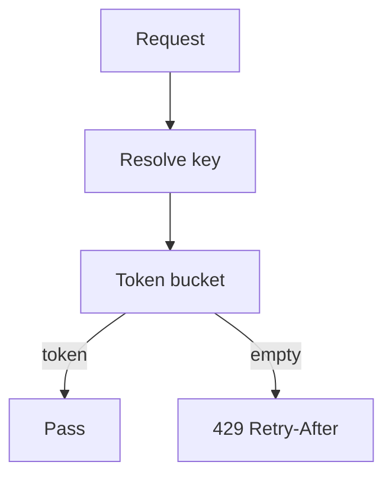

import { ConceptTemplate } from '@/features/kb/components/templates/ConceptTemplate'
import { Callout } from '@/features/kb/components/mdx/Callout'
import { ComparisonTable } from '@/features/kb/components/mdx/ComparisonTable'

export default function Layout({ children }) {
  return (
    <ConceptTemplate title="Rate Limiting">
      {children}
    </ConceptTemplate>
  )
}

**Rate limiting** is a policy: this key may do N units per window. Units might be requests, tokens, or expensive search units. Limits protect your database, enforce plan tiers, and slow abuse. They are not a substitute for authentication or for backpressure from a truly overloaded dependency.

## 1. Deep Dive and Mechanics

**Token bucket.** Tokens refill at rate r, bucket holds burst b. A request costs one token. This is the default modern algorithm: smooth rate plus controlled burst.

**Fixed window.** Count in [00:00, 00:01). Cheap and bursty at the window edge (double fire).

**Sliding window / sliding log.** Fairer, more state.

**Where it runs.** Edge (cheap, coarse), gateway (per API key), or service (per-tenant expensive query). Distributed limits need a shared counter (Redis) or an approximate local limit plus a global reconciler.

<Callout icon="info" title="Return 429 with a hint">
Tell honest clients Retry-After or X-RateLimit-Reset. Silent drops look like an outage and they retry harder.
</Callout>

## 2. Mathematical / Theoretical Foundation

Long-run admitted rate is at most r. Instantaneous burst is at most b. If arrivals are Poisson with mean lambda greater than r, reject probability is positive and the bucket spends time empty.

Sharded counters (one per gateway replica) over-admit by about the number of shards times b unless you coordinate. That may be acceptable at the edge.

<ComparisonTable
  headers={['Algorithm', 'Burst', 'Fairness', 'State']}
  rows={[
    ['Token bucket', 'Up to b', 'Good', 'Tokens + timestamp'],
    ['Fixed window', '2N at boundary', 'Weak', 'One counter'],
    ['Sliding window', 'Smoother', 'Better', 'More counters'],
    ['Leaky bucket', 'Queued / shaped', 'Smooth output', 'Queue'],
  ]}
/>

## 3. Real-World Implementation

```python
import time

class TokenBucket:
    def __init__(self, rate, burst):
        self.rate = rate
        self.burst = burst
        self.tokens = burst
        self.t = time.monotonic()

    def allow(self, cost=1):
        now = time.monotonic()
        self.tokens = min(self.burst, self.tokens + (now - self.t) * self.rate)
        self.t = now
        if self.tokens < cost:
            return False
        self.tokens -= cost
        return True
```

Store this in Redis with a Lua script for atomicity across gateway replicas when you need a global cap.

## 4. Visualizations



## 5. Interview Prep

**Q: Per IP versus per user versus per API key?**
**A:** IP is coarse (NAT) and easy to rotate. User and key map to a billable entity. Use all three at different layers: IP at WAF, key at gateway, user at the expensive query.

**Q: How do you rate-limit a distributed fleet?**
**A:** Centralized Redis counters, or local limits plus a global budget, or an edge service. Exact global limits add latency; many products accept slight over-admit.

**Q: Rate limit versus quota?**
**A:** Rate is short window (per second). Quota is long (per month). Both matter for billing plans.

## 6. Production Use Cases

- **Public APIs** with free and paid buckets.
- **Login and OTP** endpoints to blunt stuffing.
- **Expensive AI or search** endpoints priced in tokens not raw QPS.

<Callout icon="tip" title="Limit the expensive unit">
One "search" may cost 50x a ping. Charge tokens, not raw requests, or a legal client will still knock you over.
</Callout>
