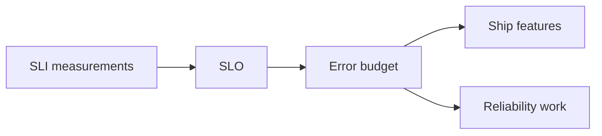

import { ConceptTemplate } from '@/features/kb/components/templates/ConceptTemplate'
import { Callout } from '@/features/kb/components/mdx/Callout'
import { ComparisonTable } from '@/features/kb/components/mdx/ComparisonTable'

export default function Layout({ children }) {
  return (
    <ConceptTemplate title="Reliability">
      {children}
    </ConceptTemplate>
  )
}

**Reliability** is whether the system does the right thing for a stretch of time. Availability is "can I talk to it now." Reliability includes "did it charge twice," "did it lose the upload," and "did the nightly job run." SRE treats reliability as an engineered property with SLIs, not a vibe.

## 1. Deep Dive and Mechanics

You measure **SLIs** (success rate, freshness, correctness samples), set **SLOs**, and spend an **error budget**. When the budget is gone, you freeze features and fix toil. That is how reliability competes with feature velocity in the open.

**Correctness SLIs** are hard and necessary. Canary reads against a ledger. Checksums on blobs. Shadow compares on a new ranking model. Uptime alone will not catch a silent wrong multiply.

**Human reliability.** On-call load, runbooks, and deploy friction. A system that pages twice a night will be patched in a hurry and get worse.

<Callout icon="info" title="Reliability is a user promise">
The SLO is written in user terms: successful checkouts, fresh reads, jobs finished by 7:00. Internal CPU is a diagnostic.
</Callout>

## 2. Mathematical / Theoretical Foundation

Reliability R(t) is the probability of no failure in [0, t]. MTTF and MTTR combine into availability ~ MTTF / (MTTF + MTTR) for repairable systems. Improving MTTR (fast rollback) often beats chasing MTTF.

Error budgets convert SLO to a countable allowance. Burn rate is budget-spend per hour versus the ideal linear spend.

<ComparisonTable
  headers={['Word', 'Question', 'Typical SLI']}
  rows={[
    ['Availability', 'Can I use it now', 'Success ratio'],
    ['Reliability', 'Does it keep working right', 'Success plus correctness'],
    ['Durability', 'Is the write still there', 'Loss rate, restore tests'],
    ['Resilience', 'How ugly is failure', 'MTTR, blast radius'],
  ]}
/>

## 3. Real-World Implementation

```
# Conceptual SLO
# SLI: proportion of checkout RPCs that finish 2xx in 800 ms
# SLO: 99.9 percent over 28 days
# Budget: 0.1 percent of eligible RPCs
# Fast-burn alert: 2 percent budget in 1 hour
```

Exclude bad-input 4xx if the user cannot succeed anyway. Do not exclude "our outage."

## 4. Visualizations



## 5. Interview Prep

**Q: Reliability versus availability?**
**A:** Availability is a slice (up now). Reliability is the broader habit of correct service over time, including silent data bugs and batch jobs.

**Q: What if product wants 100 percent?**
**A:** There is no 100 percent. There is a cost curve. Make them pick a number and a price.

**Q: How do you improve reliability next quarter?**
**A:** Kill the top budget burners: one flaky deploy, one dependency without a timeout, one missing backup test. Do not start with a rewrite.

## 6. Production Use Cases

- **SRE error-budget policy** between product and platform.
- **Correctness probes** on billing and permissions.
- **Game-day programs** that measure MTTR, not just architecture diagrams.

<Callout icon="tip" title="Test restores, not only backups">
A backup you have never restored is a rumor. Reliability includes the recovery path.
</Callout>
