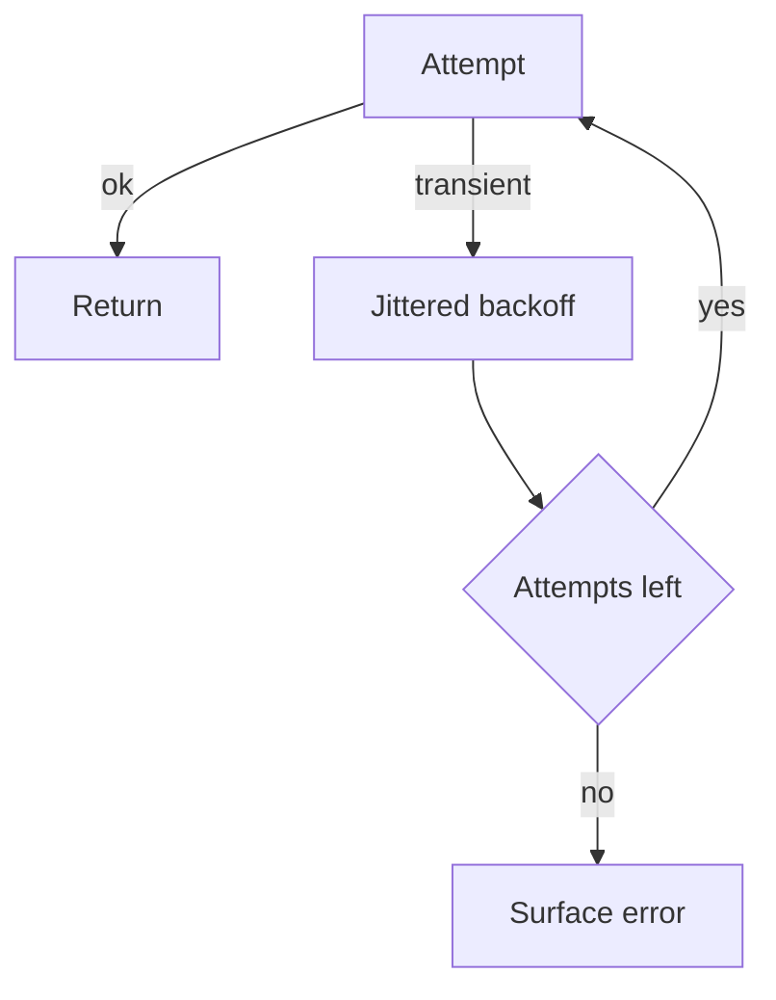

import { ConceptTemplate } from '@/features/kb/components/templates/ConceptTemplate'
import { Callout } from '@/features/kb/components/mdx/Callout'
import { ComparisonTable } from '@/features/kb/components/mdx/ComparisonTable'

export default function Layout({ children }) {
  return (
    <ConceptTemplate title="Retry Strategies">
      {children}
    </ConceptTemplate>
  )
}

**Retries** repeat a failed attempt because many faults are brief: a blip, a leader election, a full connection pool. Blind retries turn a small outage into a herd. A strategy is the set of rules: which errors, how many times, how long to wait, and whether the call is safe to repeat.

## 1. Deep Dive and Mechanics

**Idempotency first.** GET, PUT of the same body, and deletes keyed by id are usually safe. POST that charges a card is not, unless you send an Idempotency-Key the server stores.

**Backoff and jitter.** Exponential backoff (100 ms, 200 ms, 400 ms, ...) plus random jitter so clients do not align. Full jitter (pick uniform in [0, cap]) works well.

**Budgets.** Cap attempts and total time. Do not retry 429 forever. Do not retry 400. Do not retry if the breaker is open.

<Callout icon="warning" title="Retries are load amplifiers">
If 20 percent of calls time out and each retries twice, the dependency sees about 1.4x traffic when it is least able to take it.
</Callout>

## 2. Mathematical / Theoretical Foundation

If each attempt fails independently with probability p, P(success by n) = 1 - p^n. Failures are not independent in an outage (p jumps toward 1). Then retries only add load.

Hedged requests (send a duplicate after a delay) cut tail latency and double load on the tail. Use for read-only, cheap, idempotent calls.

<ComparisonTable
  headers={['Error', 'Retry', 'Why']}
  rows={[
    ['408 / 503 / timeout', 'Yes, with jitter', 'Often transient'],
    ['429', 'Yes, honor Retry-After', 'You are the overload'],
    ['401 / 403 / 404', 'No', 'Will not change'],
    ['409 conflict', 'Maybe after refresh', 'Not a blind retry'],
    ['Unsure POST', 'Only with idempotency key', 'Duplicate side effect'],
  ]}
/>

## 3. Real-World Implementation

```python
import random
import time

def retry(fn, attempts=4, base=0.1, cap=2.0):
    last = None
    for i in range(attempts):
        try:
            return fn()
        except TransientError as e:
            last = e
            sleep = min(cap, base * (2 ** i))
            time.sleep(random.random() * sleep)  # full jitter
    raise last
```

Classify TransientError tightly. Socket timeout maybe. Application 500 on "card_declined" never.

## 4. Visualizations



## 5. Interview Prep

**Q: Why jitter?**
**A:** Synchronized clients retry on the same clock after a shared outage. They recreate the outage. Jitter smears the herd.

**Q: Where should retries live?**
**A:** One place. If the client, the mesh, and the SDK all retry, you get multiplicative storms. Document the owner.

**Q: Retry versus queue?**
**A:** Short retries hide blips on the request path. Long retries belong in a queue with a DLQ so the user is not connected for two minutes.

## 6. Production Use Cases

- **Idempotent reads** to a replica set during leader election.
- **Webhook delivery** with exponential backoff for hours, then DLQ.
- **Mesh defaults** with tight budgets on non-idempotent RPCs (often: do not retry).

<Callout icon="tip" title="Log attempt number on every span">
attempt=3 is how you prove a storm. Without it, you will argue about client behavior from memory.
</Callout>
