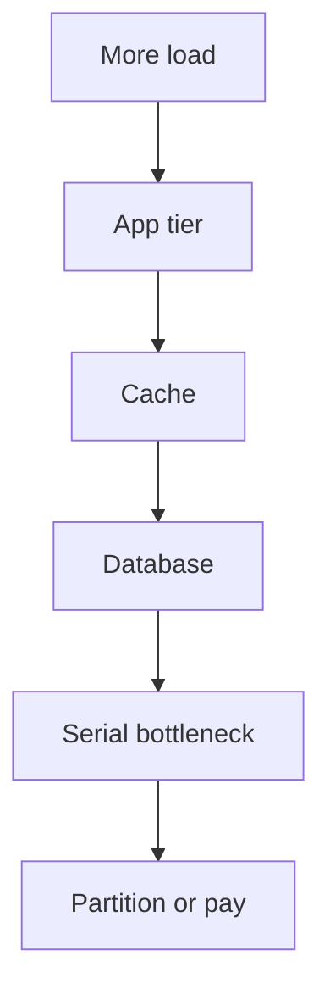

import { ConceptTemplate } from '@/features/kb/components/templates/ConceptTemplate'
import { Callout } from '@/features/kb/components/mdx/Callout'
import { ComparisonTable } from '@/features/kb/components/mdx/ComparisonTable'

export default function Layout({ children }) {
  return (
    <ConceptTemplate title="Scalability">
      {children}
    </ConceptTemplate>
  )
}

**Scalability** is how a system behaves as load grows: more users, more data, more regions. A scalable design adds capacity without a rewrite and without linear cost in human toil. It is not "we run on many pods." It is a curve: QPS at SLO versus dollars and versus engineering time.

## 1. Deep Dive and Mechanics

Find the **bottleneck**. CPU on the app, IOPS on the primary, a global lock, a single-threaded event loop, a shard with a celebrity key. Scale that thing. Everything else is decoration.

**Dimensions.** Load (requests), data size, and complexity (tenants, features). Some systems scale in QPS and die on data size (unpartitioned indexes). Some scale in data and die on fan-out (every request touches every shard).

**Elasticity** is how fast you can add capacity. Scalability is whether adding capacity works at all.

<Callout icon="info" title="Draw the curve">
If 2x machines is not about 2x goodput, write down why. That sentence is the scalability design.
</Callout>

## 2. Mathematical / Theoretical Foundation

Amdahl: speedup less than or equal to 1 / (s + (1-s)/N). Universal Scalability Law adds a coherency term: contention and cross-talk eventually dominate. That is why "just add nodes" fails for chatty monoliths and for huge scatter-gather.

Cost scalability: if your bill is linear in QPS and you have no waste, you are doing well. If it is super-linear (cross-AZ chatter, O(N^2) meshes), fix the communication pattern.

<ComparisonTable
  headers={['Symptom', 'Likely limit', 'Move']}
  rows={[
    ['CPU high, latency OK', 'Compute', 'Scale out stateless'],
    ['DB CPU / locks', 'Primary', 'Cache, then shard'],
    ['p99 explodes before CPU', 'Queueing or chatter', 'Reduce hops, shed'],
    ['One tenant hot', 'Skew', 'Isolate cell or split key'],
  ]}
/>

## 3. Real-World Implementation

```python
def goodput_at_slo(qps_points, p99_ms, slo_ms=200):
    return max((q for q, p in zip(qps_points, p99_ms) if p <= slo_ms), default=0)
```

Capacity is the max QPS that still meets the SLO, not the QPS at which the process melts. Load-test that definition.

## 4. Visualizations



## 5. Interview Prep

**Q: How do you design for 10x?**
**A:** State the bottleneck at 1x, show what breaks at 10x, and pick the one change that moves the bottleneck (cache, replica, shard, async). Do not list 20 patterns.

**Q: Scalability versus performance?**
**A:** Performance is fast at current load. Scalability is still correct and fast (enough) at much higher load. A very fast single box may not scale.

**Q: When do you shard early?**
**A:** When a single primary cannot hold the data or the write rate in the year-one model. Otherwise a well-tuned primary plus cache is simpler.

## 6. Production Use Cases

- **Read-heavy products** that scale with cache and CDN before shards.
- **Write-heavy ingest** that partitions on day one.
- **Multi-region** where scalability includes locality, not just node count.

<Callout icon="tip" title="Scale the SLO, not the vanity QPS">
A million QPS of 500s is not a scalable system. Quote goodput at the user SLO.
</Callout>
